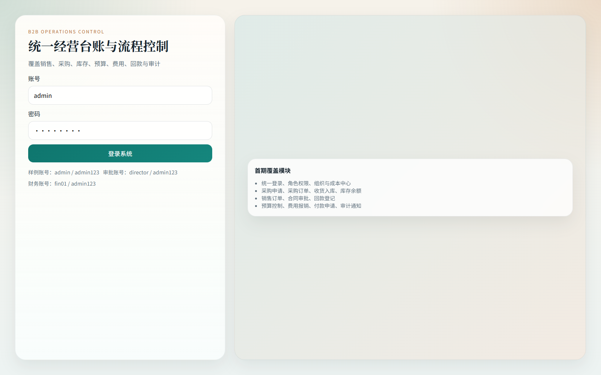
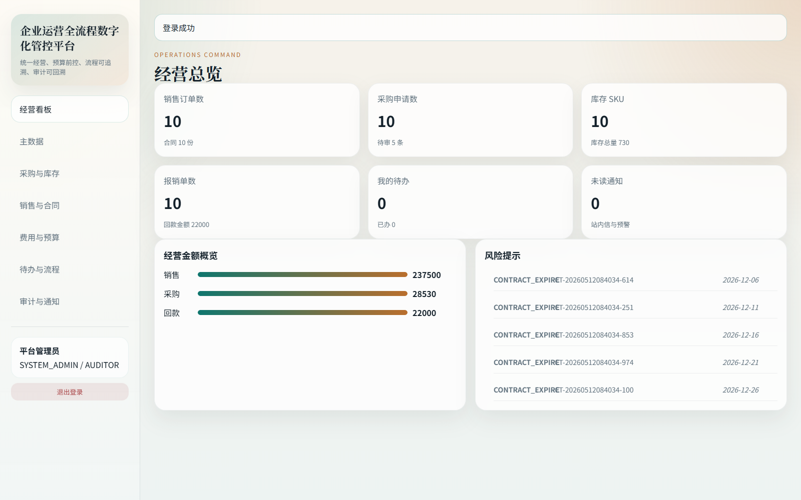
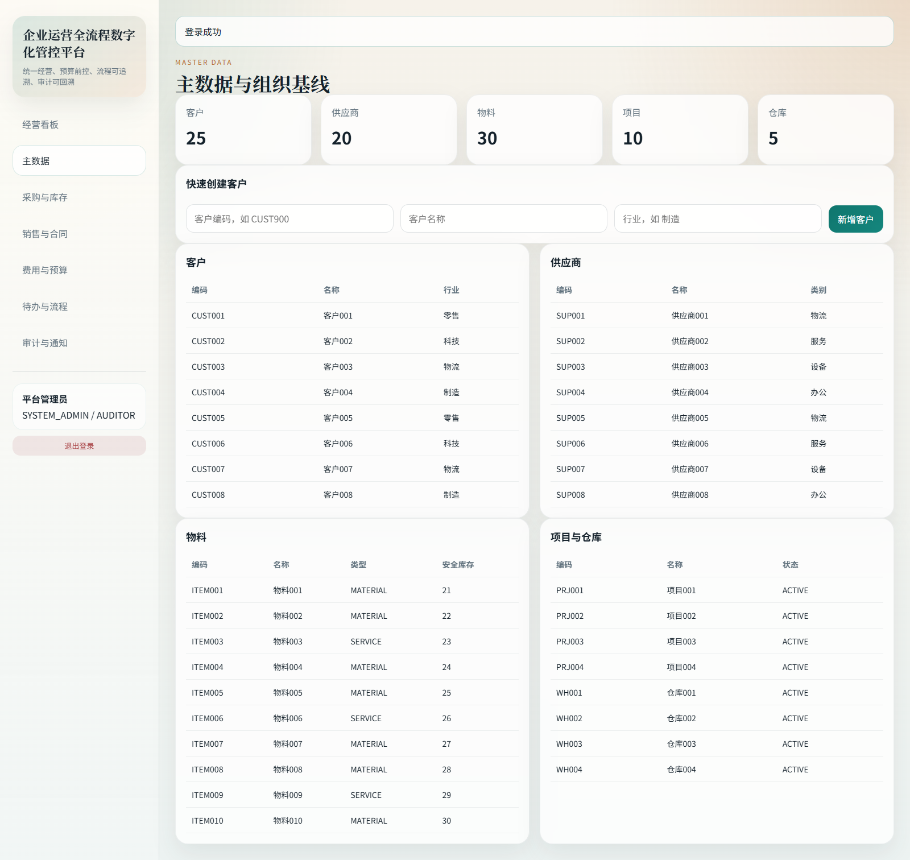
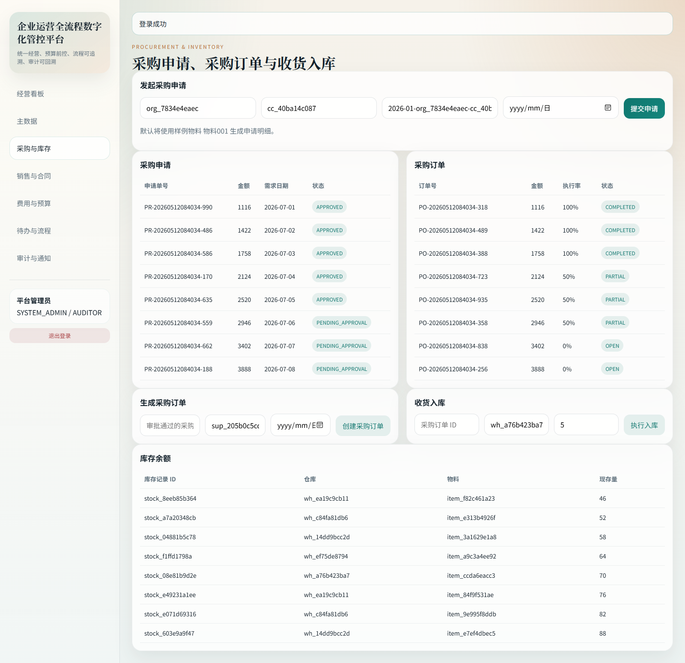
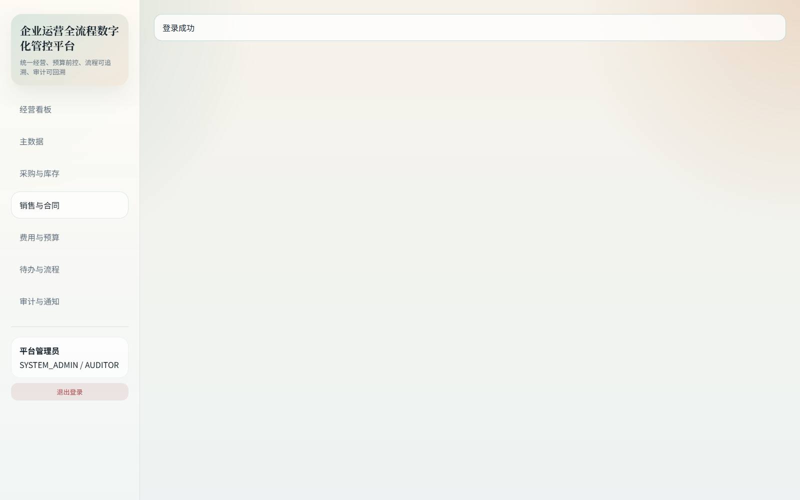
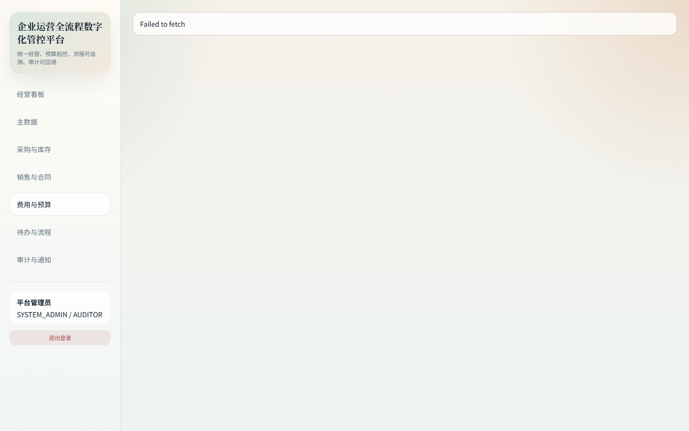
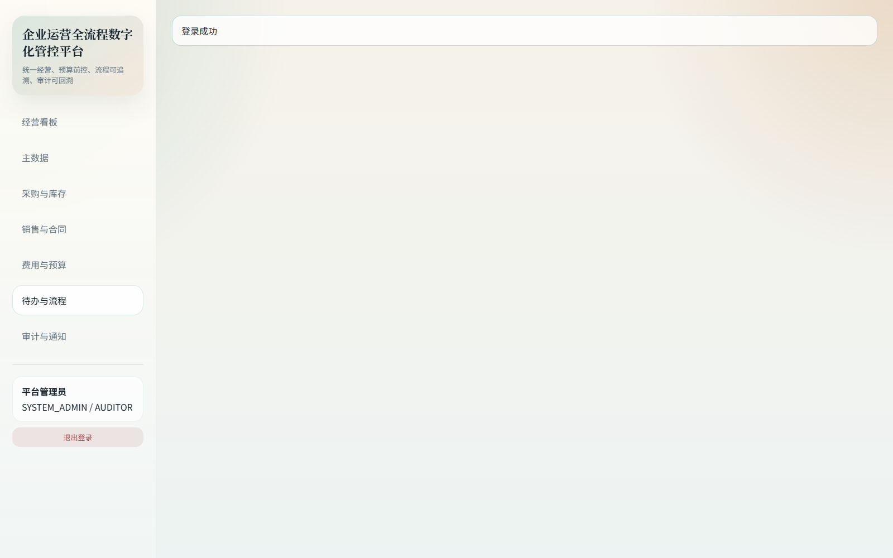
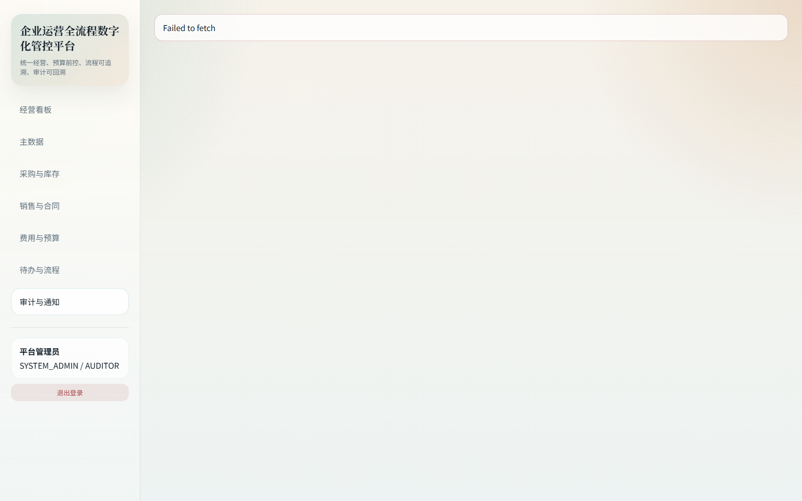

# 企业运营全流程数字化管控平台软件操作手册

## 一、文档定位与适用对象

本手册用于指导企业管理员、运营总监、采购专员、销售专员、财务专员、仓储专员以及审计专员使用 企业运营全流程数字化管控平台软件。系统面向“经营全过程数字化管控”场景设计，重点解决业务单据散落、预算控制滞后、审批链条割裂、库存与销售脱节以及审计追踪困难等问题。手册内容覆盖登录、首页、全部一级模块、端到端业务流程和常见问题处理，既可作为培训材料，也可作为上线验收、岗位交接和软著申报的正式文档。

本版本手册对应软件版本 V1.0。系统采用单入口 Web 方式运行，用户通过浏览器访问首页完成操作。示例数据已内置在系统中，首次打开即可使用样例账号体验完整流程。手册中的页面截图来自真实运行环境，截图顺序与模块说明保持一致，便于使用者对照页面位置逐步执行。

### 1.1 文档说明

本节用于说明手册结构与阅读方式。手册按照“系统入口、模块操作、流程演示、常见问题”的顺序组织，截图与步骤一一对应。阅读时建议先完成登录，再按模块顺序执行，以便验证页面状态与数据变化。若用于培训，可按章节拆分给不同岗位；若用于验收，可按每个步骤的“操作动作 + 预期结果”逐条核对。

## 二、系统入口与登录

### 2.1 登录界面总览

系统入口为 `http://127.0.0.1:8000` 或部署后的统一访问地址。登录界面左侧提供系统名称、账号密码输入框与登录按钮，右侧展示平台的首期覆盖模块，帮助用户在首次进入时快速理解平台能力边界。登录页默认展示演示账号，便于培训和验收场景直接进入系统。

登录页面的核心输入项包括用户名和密码。系统已内置管理员账号 `admin / admin123`，审批体验可使用 `director / admin123`，财务体验可使用 `fin01 / admin123`。登录成功后，系统会自动获取当前用户身份、角色编码、权限集合和数据范围，并将用户上下文加载到左侧导航与页面权限控制中。若输入错误，页面会在顶部以统一错误提示条反馈失败原因与请求号，便于后续追踪。

图1-1 展示了登录页完整布局。可以看到系统将操作入口、样例账号与首期覆盖模块同时放在登录页中，既方便首次培训，也能让业务人员在进入前理解系统已包含采购、销售、预算、审批和审计等核心场景。

### 2.2 登录操作步骤

1. 打开系统入口，进入登录页面。
2. 在“用户名”输入框中填写账号，例如 `admin`。
3. 在“密码”输入框中填写密码，例如 `admin123`。
4. 点击“登录”按钮，系统向认证接口发送登录请求。
5. 认证成功后，系统保存访问令牌与刷新令牌，并自动跳转至首页经营看板。
6. 如果登录失败，先核对账号、密码和网络状态，再根据页面返回的错误信息重试。

### 2.3 登录后的角色差异

不同角色进入系统后看到的页面布局一致，但可操作能力不同。管理员拥有全部菜单与维护能力，适合演示全流程；运营总监主要处理审批待办；财务专员重点使用预算、报销、付款与回款功能；仓储专员重点处理收货入库；审计专员主要查看审计日志和通知。这样的权限划分保证了“同平台、分职责”的使用方式，也便于企业后续上线时按组织岗位逐步推开。

## 三、首页经营看板

首页是系统的统一经营驾驶舱。左侧导航固定提供“经营看板、主数据、采购与库存、销售与合同、费用与预算、待办与流程、审计与通知”七个一级菜单，底部显示当前登录用户名称、角色编码以及退出入口。主内容区顶部展示成功或失败提示条，下方为当前页面主体内容。

经营看板页面聚合了销售订单数、采购申请数、库存 SKU、报销单数、我的待办和未读通知六类核心指标，并通过金额概览和风险提示两个卡片帮助管理者快速定位问题。金额概览分别展示销售金额、采购金额和回款金额，风险提示则提示例如待审数量、通知数量或业务预警。页面使用卡片、条形图和提示列表的组合，不要求管理者进入明细页面也能掌握当前经营状态。

图2-1 展示了首页经营看板。使用者进入首页后，建议先确认左侧身份卡中的用户信息是否正确，再查看 KPI 是否与近期操作一致。如果前一环节刚提交采购申请或报销单，可以返回首页检查待办数量、通知数量和经营金额是否发生变化，以验证业务链条是否闭环。

### 3.1 首页日常使用建议

1. 每日首次登录后优先查看“我的待办”和“未读通知”。
2. 管理岗位可对比销售、采购、回款金额，判断现金流压力。
3. 当风险提示中出现待审、超预算或通知未读时，应立即进入对应模块处理。
4. 任何业务单据提交成功后，最好回到首页查看指标变化，以便形成“提交后即回看”的使用习惯。

## 四、主数据与组织基线

主数据页面是平台所有业务单据的基础。页面上方的统计卡片显示客户、供应商、物料、项目和仓库的数量，帮助管理员快速判断基础资料是否完整。中部提供“快速创建客户”表单，支持录入客户编码、客户名称和所属行业，下方则使用表格分区域展示客户、供应商、物料以及项目与仓库信息。

主数据的意义不仅在于维护台账，更在于为采购、销售、财务和流程模块提供统一引用。比如销售订单必须选择客户，采购订单必须选择供应商，入库要关联仓库，预算和项目需要依赖成本中心与组织体系。如果主数据不完整，后续单据无法顺利发起；因此企业在正式上线前，应优先由管理员完成主数据清理和编码规则确认。

图3-1 展示了主数据页面。页面上部的统计卡片用于掌握总体规模，中部表单用于快速创建客户，表格则让管理者可以直接浏览样例数据。新增客户时，只需填写编码、名称和行业，提交成功后页面会自动刷新，新的客户记录会出现在客户表格中。

### 4.1 新增客户操作步骤

1. 进入“主数据”页面。
2. 在“快速创建客户”表单中填写客户编码，例如 `CUST900`。
3. 输入客户名称，例如“华东联营门店”。
4. 输入行业，例如“零售”或“制造”。
5. 点击“新增客户”按钮。
6. 页面提示“客户创建成功”后，系统会刷新列表，并在客户表格中展示新增结果。

### 4.2 主数据维护建议

企业在使用主数据模块时，建议先由总部统一确定编码规范，例如客户以 `CUST` 开头、供应商以 `SUP` 开头、物料以 `ITEM` 开头，再按组织职责逐步维护。项目与仓库建议同步录入所属组织和状态，以便采购与库存模块直接复用。对于高频变更的供应商评级、物料安全库存和仓库位置，也建议建立周期性巡检机制，避免后续业务使用过期资料。

## 五、采购与库存模块

采购与库存页面围绕“申请、审批、下单、收货、入库、库存回显”这一链路设计。页面顶部提供“发起采购申请”表单，录入申请组织、成本中心、预算键与需求日期后，系统会自动使用样例物料生成申请明细。中部左右两块表格分别展示采购申请列表和采购订单列表，下方则提供“生成采购订单”和“收货入库”两个表单，最底部展示库存余额。

该模块的关键价值在于预算前控与执行闭环。采购申请提交时会校验预算键和申请金额，避免超预算单据进入审批；采购订单必须来源于已审批通过的申请，避免线下绕过；收货入库后库存余额会立即更新，使仓储数据与采购数据保持一致。对于需要追踪交付执行率的企业，采购订单表中的执行率字段可快速展示订单是否已经完成、部分完成或尚未执行。

图3-2 展示了采购与库存页面。可以看到页面把发起申请、生成订单、入库和库存余额放在同一视图中，这样业务人员无需频繁跳转页面即可完成主要操作，特别适合内部协同演示和培训。

### 5.1 发起采购申请

1. 进入“采购与库存”页面。
2. 确认页面自动填充的申请组织、成本中心和预算键是否正确。
3. 选择需求日期。
4. 点击“提交申请”，系统会生成采购申请并进入审批。
5. 提交成功后，在“采购申请”表格中确认新增申请单号与状态。

### 5.2 生成采购订单

1. 待审批流程通过后，复制采购申请 ID。
2. 在“生成采购订单”区域粘贴申请 ID，并确认供应商与预计到货日期。
3. 点击“创建采购订单”。
4. 页面提示成功后，在采购订单列表中确认新订单的金额、状态与执行率。

### 5.3 收货入库与库存回显

1. 在“收货入库”区域填写采购订单 ID。
2. 确认仓库 ID 与入库数量。
3. 点击“执行入库”。
4. 系统根据采购订单和物料生成库存流水，并更新库存余额表。
5. 下拉到库存余额区域，确认相应物料在指定仓库的现存量已增加。

### 5.4 采购场景使用注意事项

若采购申请提交后提示预算不足，应返回预算模块检查预算键、成本中心和金额是否匹配；若采购订单创建失败，应先确认申请是否完成审批；若入库失败，则要检查采购订单编号、仓库编号以及数量是否超出可入库范围。建议企业上线后将采购编号、预算键和仓库编号纳入培训重点，减少因录入错误造成的流程阻塞。

## 六、销售与合同模块

销售与合同页面用于支撑从商机确认到合同生效再到回款追踪的业务链路。页面左侧表单用于创建销售订单，右侧表单用于基于销售订单发起合同审批。下方左右两张表格分别展示销售订单和合同清单，其中合同表格提供金额、回款进度和状态，方便业务负责人掌握哪些合同已生效、哪些仍在审批中、哪些已完成回款。

销售与合同模块强调“订单先行、合同跟进、回款闭环”的管理逻辑。订单记录业务需求，合同体现管理审批和法律文本流程，回款登记则用于跟踪资金回笼进度。通过将订单、合同和回款进度连接在同一模块中，企业能够快速发现“订单已下但合同未批”“合同已生效但回款滞后”等经营风险。

图3-4 展示了销售与合同页面。创建销售订单后，用户可以直接在页面下方表格中获取订单 ID，再回填到合同创建表单中发起审批。这样既减少了跨页面查找，也让培训过程更清晰直观。

### 6.1 创建销售订单

1. 进入“销售与合同”页面。
2. 在“创建销售订单”表单中确认客户 ID、交付日期和订单金额。
3. 点击“新建销售订单”。
4. 系统创建订单后，在销售订单表格中回显订单号、客户、金额和状态。

### 6.2 发起合同审批

1. 从销售订单表格中复制目标订单 ID。
2. 在“创建合同”表单中填写销售订单 ID、到期日期和合同金额。
3. 点击“发起合同审批”。
4. 提交后合同将进入流程模块，待运营总监和财务专员审批。
5. 审批完成后，合同状态会从待审转为生效，回款进度初始为 0。

### 6.3 销售场景建议

销售人员应优先保证客户主数据与订单金额准确，再触发合同审批；若合同金额与订单金额不一致，应在业务规则中明确允许范围并保留附件说明。管理层可定期通过合同表的回款进度判断销售转现金效率，并结合财务模块的回款登记结果进行核对。

## 七、费用与预算模块

费用与预算页面是企业内控的重要区域。页面上方左侧可以新增预算，右侧可以发起费用报销；中部左侧可以基于已批准报销创建付款申请，右侧可以登记合同回款；下方表格则分别展示预算清单以及费用与付款摘要。平台通过预算键、成本中心和组织单元把预算、报销、付款和回款串联起来，帮助财务部门在业务发生时而不是月末结算时控制风险。

系统支持“硬预算控制”，即预算不足时直接阻断业务提交，并返回明确的业务冲突提示。这样一来，业务人员在发起报销或采购时就能立刻知道预算是否可用，避免审批人处理一条本就不应进入流程的单据。付款申请接口还引入了幂等头控制，防止重复点击导致重复付款申请，这是企业资金类场景中非常关键的保护机制。

图3-5 展示了费用与预算页面。预算、报销、付款和回款被集中在同一页面，便于财务人员按顺序处理，也便于管理层在一个视图内观察“预算额度、费用消耗、付款安排、合同回款”的整体关系。

### 7.1 新增预算

1. 进入“费用与预算”页面。
2. 在“新增预算”表单中填写预算年度、月份、金额和预算键。
3. 系统会自动复用当前样例预算的组织和成本中心。
4. 点击“新增预算”后，在预算表格中确认新预算已生成。

### 7.2 提交报销

1. 在“发起费用报销”表单中确认报销人 ID、成本中心、预算键和金额。
2. 点击“提交报销”。
3. 若预算充足，系统将生成报销单并提交审批；若预算不足，页面会提示冲突原因。
4. 提交成功后，可在“费用与付款”表格中查看报销单编号、金额、状态和类型。

### 7.3 创建付款申请

1. 从已审批报销单中选择一个源单据 ID。
2. 在“创建付款申请”表单中填写收款方和金额。
3. 点击“发起付款”，系统生成付款申请编号。
4. 若用户重复触发相同幂等请求，系统将返回同一付款申请，避免重复创建。

### 7.4 登记回款

1. 在“登记回款”表单中填写合同 ID、回款金额、回款日期和回款方式。
2. 点击“登记回款”。
3. 系统将更新合同回款进度，并可在销售与合同模块中同步查看。

### 7.5 财务场景使用建议

财务部门建议将预算键设计为“年度-月份-组织-成本中心”的组合，以便快速定位预算来源；对报销、付款和回款等资金类业务，建议建立复核岗位，通过待办中心完成审批后再执行下一步；若企业后续需要接入真实银行回单、电子发票或合同附件，可在现有结构上扩展文件资产表和外部接口，而无需重构主流程。

## 八、待办与流程模块

待办与流程页面是各岗位处理协同审批的核心入口。页面分为四块：左上为待办任务，右上为已办任务，左下为我的发起，右下为流程模板。待办卡片显示当前节点名称、业务类型、业务 ID 与截止时间，并提供“通过”“驳回”按钮；已办卡片显示用户已执行的动作；我的发起用于回看自己提交过的流程；流程模板则帮助管理员了解采购申请、合同审批和报销三类流程的节点数量与适用业务。

该模块的设计目标不是替代复杂 BPM 平台，而是以轻量方式为企业经营关键单据提供足够明确的审批闭环。对于采购和合同场景，系统默认使用“运营总监审批 + 财务审批”的两级流程；报销场景则使用“直属负责人审批 + 财务审批”。审批动作一旦提交，相应业务状态、通知中心与首页待办数量会同步变化，确保业务结果能够被多模块感知。

图3-3 展示了待办与流程页面。审批人员可直接在卡片上点击“通过”或“驳回”，提交后页面会即时刷新，已办列表也会追加对应记录。这种设计降低了审批动作的操作成本，特别适合企业内部快速流转。

### 8.1 处理待办

1. 进入“待办与流程”页面。
2. 在“待办任务”区域找到属于自己的审批卡片。
3. 确认业务类型、业务 ID 和截止时间。
4. 点击“通过”或“驳回”。
5. 系统提示“审批动作已提交”后，卡片会从待办移动到已办或交接至下一审批节点。

### 8.2 查看我的发起

1. 在左下“我的发起”区域查看自己发起的采购、合同或报销流程。
2. 关注流程状态是否为 `IN_PROGRESS`、`COMPLETED` 或业务终态。
3. 若流程长期停留，可根据业务 ID 联动通知审批人员及时处理。

### 8.3 流程管理建议

企业在正式使用前应先确定审批角色映射与超时策略。当前样例模板适合标准双节点审批场景，如果后续要加入法务、风控、出纳或区域负责人节点，可以在流程模板结构中按业务类型扩展节点定义。审批模块与业务模块解耦后，企业既能保持页面简单，也能在后续增加流程复杂度时保持清晰的领域边界。

## 九、审计与通知模块

审计与通知页面用于满足管理追踪和用户提醒两类需求。左侧审计日志表格记录动作类型、业务类型、业务 ID 和请求号，适合审计人员、管理员或排障人员检索关键请求；右侧通知中心以卡片形式展示通知标题、内容、业务引用类型和已读状态，用户可以直接点击“设为已读”完成处理。

该页面的价值在于将“系统知道发生了什么”和“用户知道该做什么”分开呈现。审计日志偏向事实留痕，关注谁在什么时候对什么业务做了什么动作；通知中心偏向任务提醒，关注当前用户还需要关注哪些事件。两者结合可以帮助企业在事后稽核、异常调查和流程追踪中快速定位上下文。

图3-6 展示了审计与通知页面。通知卡片会以不同样式区分已读与未读状态，用户点击“设为已读”后页面会即时刷新并改变展示样式。若某个业务流程引发多条通知，用户可先通过通知判断影响范围，再结合审计日志和请求号定位详细链路。

### 9.1 审计日志查看方法

1. 进入“审计与通知”页面。
2. 在审计日志表中查看动作类型与业务类型。
3. 如需追踪某次具体请求，记录请求号并与后台日志或接口返回结果交叉核对。
4. 对于权限不足的用户，系统会禁止访问审计日志接口，防止敏感数据泄露。

### 9.2 通知处理方法

1. 在通知中心找到未读卡片。
2. 阅读标题、正文和业务引用类型。
3. 点击“设为已读”。
4. 系统更新状态后，卡片样式会变化，表示该通知已经处理。

## 十、端到端业务流程演示

为了帮助企业理解平台如何把多个模块串成完整闭环，建议按以下顺序演示一条典型业务主线：

1. 管理员登录系统并查看首页经营看板。
2. 在主数据模块确认客户、供应商、物料、仓库与项目等基础资料已存在。
3. 在采购与库存模块发起采购申请，系统自动进行预算校验并创建待办。
4. 使用运营总监账号进入待办中心执行首次审批，再用财务账号完成第二次审批。
5. 返回采购与库存模块，根据审批通过的申请创建采购订单并执行收货入库。
6. 观察库存余额变化，并回到首页确认采购、库存或待办指标变化。
7. 再次使用管理员账号，在销售与合同模块创建销售订单和合同审批流程。
8. 在待办中心完成合同审批后，到费用与预算模块登记回款。
9. 查看合同回款进度是否增长，并在首页确认回款指标变化。
10. 最后进入审计与通知模块，检查关键动作是否有对应日志与通知记录。

这条主线覆盖了“登录、主数据、采购、审批、入库、首页、销售、合同、回款、审计”十大关键触点，能够充分证明平台具备全过程数字化管控的能力。企业在培训时也可以按此顺序分角色演练，使业务人员不仅知道如何操作，更理解每一步为什么会影响后续节点。

## 十一、常见问题与处理建议

### 11.1 登录失败怎么办

先确认账号和密码是否输入正确，再确认浏览器是否能访问系统地址。如果页面返回错误提示并带有请求号，可将请求号提供给管理员排查。如果是首次部署后访问失败，通常需要检查服务进程是否已经启动以及端口是否可用。

### 11.2 采购申请提示预算不足怎么办

优先检查预算键、成本中心、预算月份和申请金额是否匹配。若业务确实需要超预算执行，应先由财务或管理员在预算模块补充预算，再重新发起申请。不要绕过预算校验直接在线下处理，否则会破坏平台中的资金控制逻辑。

### 11.3 为什么审批通过后还不能创建采购订单

通常是因为使用了错误的申请 ID，或者审批尚未流转到最终完成状态。建议在待办与流程页面确认该业务实例已经完成全部节点审批，再返回采购页面创建采购订单。

### 11.4 为什么看不到审计日志

审计日志接口受权限控制。销售、采购等普通业务角色默认不能访问审计日志；管理员或审计角色才可查看。如果业务确有需要，应由管理员评估后分配权限，而不是在系统内绕过控制。

### 11.5 为什么重复点击付款按钮没有生成两条付款申请

付款申请接口启用了幂等控制，目的是避免用户因网络抖动或重复点击造成重复付款。若用户使用的是同一个幂等键，请求会返回同一条记录，这是预期行为，不是系统故障。

## 十二、版本信息

- 软件全称：企业运营全流程数字化管控平台软件
- 软件版本：V1.0
- 文档版本：V1.0
- 更新日期：2026-05-13
