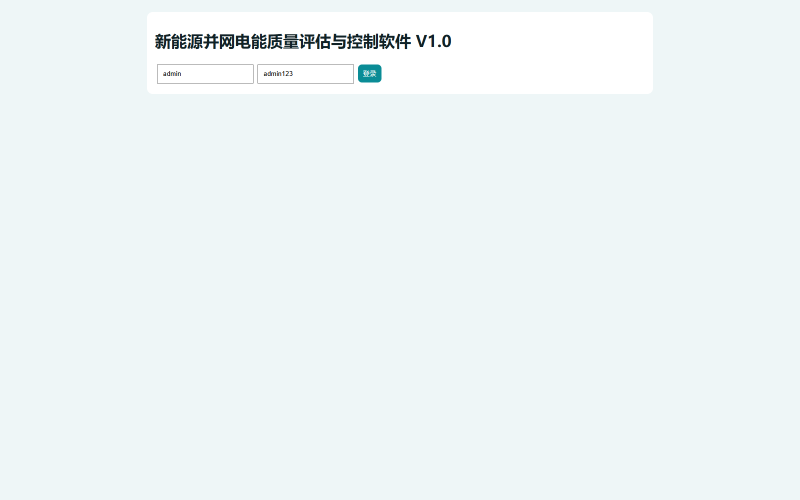

# 新能源并网电能质量评估与控制软件操作手册

## 一、文档定位与适用对象
用于指导管理员和调度人员完成系统登录、看板查看、告警处置和控制执行。

### 1.1 文档说明
本文档用于培训、验收和日常操作。

## 二、系统入口与登录
访问 `http://127.0.0.1:8010`，输入账号密码后登录。

## 三、核心功能操作
1. 登录后查看运行看板。
2. 在告警表确认高等级告警。
3. 输入工单号执行控制并查看返回状态。

## 四、端到端流程演示
登录 -> 看板 -> 告警 -> 控制执行 -> 回读状态。

## 五、常见问题
1. 401错误：确认是否已登录。
2. 页面无数据：确认服务是否启动。
