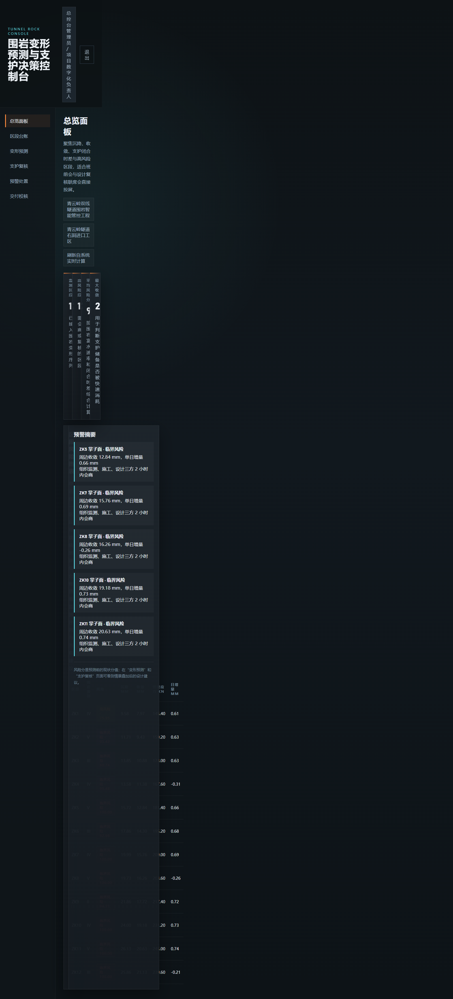
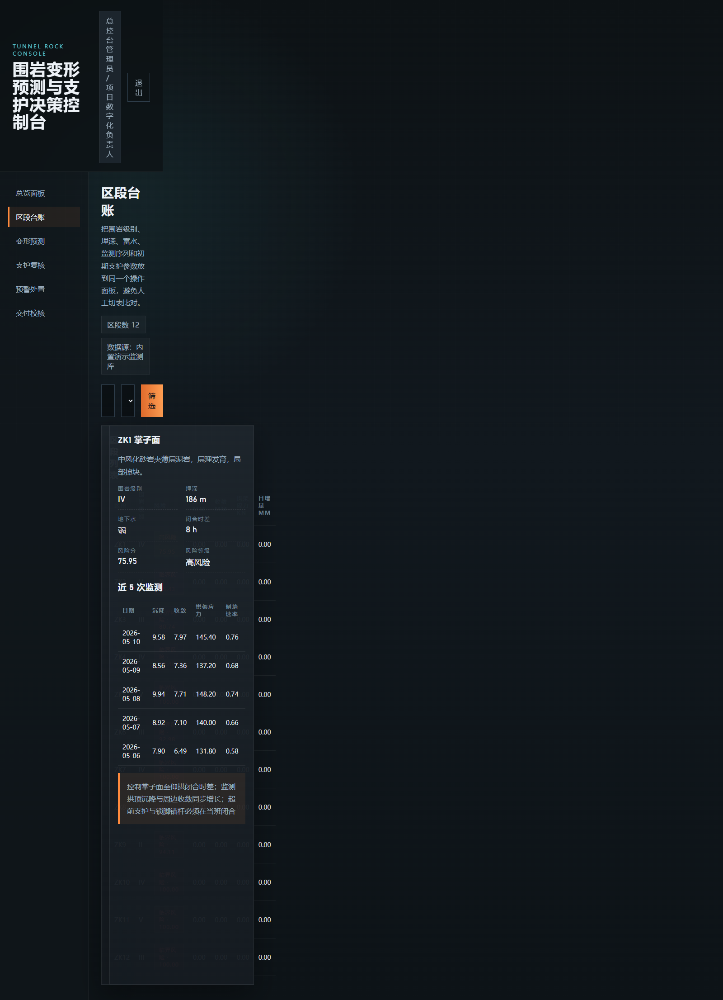
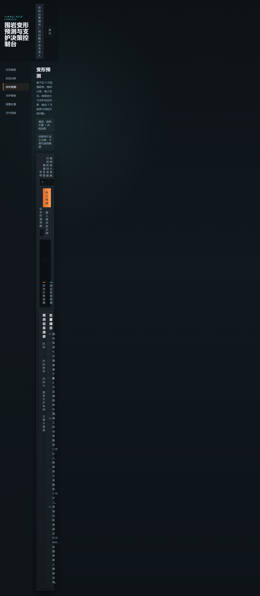
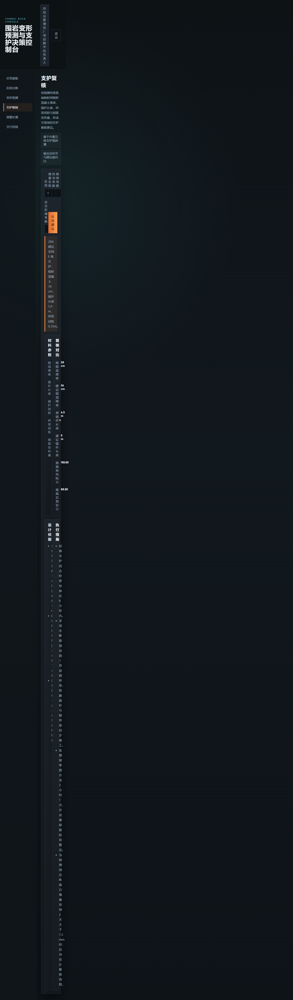
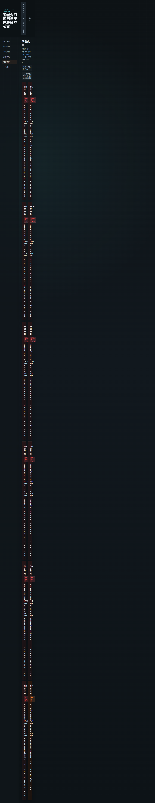
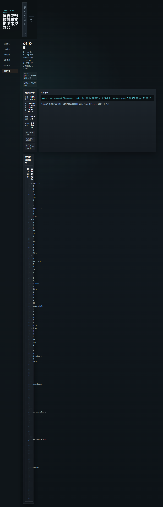

# 1. 文档定位与适用对象
## 1.1 文档说明
本手册用于说明“隧道围岩变形预测与支护设计辅助软件 V1.0”的运行方式、页面结构、功能路径、端到端业务流程和常见问题。手册只描述当前版本已经落地并可在系统界面直接操作的内容，不扩写未实现的扩展设想，也不把通用工程管理流程混入本软件说明。

## 1.2 适用对象
- 项目总控台管理员：查看总览、确认运行状态、执行交付前校核。
- 监测工程师：查看区段台账、监测趋势、风险预警与预测结果。
- 支护设计师：查看支护复核建议、材料参数和设计依据。

## 1.3 使用前提
- 本地已安装 Python 3.11。
- 已执行 `python -X utf8 scripts/seed_demo_data.py` 生成演示数据与接口契约。
- 已执行 `python apps/api/main.py` 启动服务。
- 浏览器可访问 `http://127.0.0.1:8010`。

# 2. 系统入口与登录
## 2.1 登录界面总览
系统入口为本地浏览器地址 `http://127.0.0.1:8010`。登录页左侧显示软件名称与控制台说明，右侧显示账号输入、密码输入和登录按钮。该页用于在班前会或本地演示时快速进入控制台。

系统内置三类演示账号：
- `admin / admin123`：总控台管理员
- `monitor / admin123`：监测工程师
- `support / admin123`：支护设计师

图1-1 登录页。展示软件名称、登录表单和演示账号说明区域。

## 2.2 登录操作步骤
1. 启动服务后，在浏览器打开 `http://127.0.0.1:8010`。
2. 在“账号”输入框中填写用户名。
3. 在“密码”输入框中填写密码。
4. 点击“进入控制台”按钮。
5. 登录成功后，系统跳转到总览面板，并在页面右上角显示当前身份与职务。

## 2.3 登录结果说明
- 登录成功：系统显示顶部标题栏、左侧导航和主内容区。
- 登录失败：登录按钮下方出现错误提示，不写入业务数据。
- 未登录访问业务接口：接口统一返回未授权信息，页面不渲染业务区内容。

# 3. 首页操作
## 3.1 首页布局与导航
首页即总览面板。页面由顶部栏、左侧菜单栏和主内容区三部分组成：
- 顶部栏：显示软件标题、当前用户信息和退出按钮。
- 左侧栏：依次显示“总览面板、区段台账、变形预测、支护复核、预警处置、交付校核”六个一级菜单。
- 主内容区：显示统计卡片、风险热表和预警摘要。

图2-1 首页完整界面。展示顶部栏、左侧导航栏、统计卡片和区段风险热表。

## 3.2 首页关键流程
1. 从登录页跳转到首页。
2. 查看监测区段数、高风险段数量、平均风险分和最大收敛值。
3. 在风险热表中识别需要重点关注的区段。
4. 点击左侧菜单切换到区段台账、变形预测或支护复核页面。

# 4. 一级功能模块与二级操作说明
## 4.1 区段台账
区段台账用于集中查看区段主数据、围岩级别、埋深、地下水、支护闭合时差和近 5 次监测记录。

### 4.1.1 区段筛选
1. 在筛选栏输入关键字，可按区段名称、里程标识或围岩级别检索。
2. 在风险下拉框中选择“低风险、中风险、高风险、临界风险”之一。
3. 点击“筛选”按钮，系统刷新区段列表。
4. 单击区段表格中的任一行，右侧显示该区段详细台账信息。

图3-1 区段台账页面。展示筛选栏、区段列表和右侧详细信息卡片。

### 4.1.2 台账结果说明
- 列表区展示风险等级、沉降、收敛、拱架应力和日增量。
- 详情区展示围岩级别、埋深、地下水、闭合时差和控制要点。
- 近 5 次监测表可用于判断增长是单次波动还是持续抬升。

## 4.2 变形预测
变形预测页用于叠加施工扰动和降雨情景，生成未来 7 天的拱顶沉降与周边收敛序列。

### 4.2.1 情景参数输入
1. 在“区段”下拉框中选择目标掌子面。
2. 在“情景名称”中填写本次分析场景，例如“深埋软岩暴雨扰动”。
3. 输入开挖扰动系数、降雨放大系数和安全折减系数。
4. 点击“执行预测”。

### 4.2.2 结果查看
系统输出两条趋势线：
- 橙色线：拱顶沉降预测。
- 蓝绿色线：周边收敛预测。

同时输出风险分、风险等级、推荐支护级别和处置提示。

图3-2 变形预测页面。展示情景输入区、趋势图和预测结果摘要。

## 4.3 支护复核
支护复核页根据预测结果映射出支护等级和材料参数，用于设计复核而不是正式签认替代。

### 4.3.1 生成建议
1. 选择目标区段。
2. 保持与预测页一致的情景参数，确保口径统一。
3. 点击“生成建议”。
4. 查看喷混厚度、锚杆长度、锚杆间距、拱架间距和预留变形量。

### 4.3.2 对比内容
- 原初支参数与建议参数的差异。
- 措施前风险分与措施后预估风险分。
- 执行措施和设计依据说明。

图3-3 支护复核页面。展示参数对比卡片、执行措施和设计依据。

## 4.4 预警处置
预警处置页将风险识别直接转化为现场动作。每张卡片都包含触发条件、处置动作和责任人。

### 4.4.1 预警卡片查看
1. 点击左侧导航“预警处置”。
2. 按风险分倒序查看预警卡片。
3. 根据卡片内容确认触发条件和责任人。
4. 结合区段台账或支护复核页做进一步分析。

图3-4 预警处置页面。展示不同风险等级的预警卡片及其责任人说明。

## 4.5 交付校核
交付校核页用于在生成三件套前确认系统状态、最近预测、最近支护建议和接口清单。

### 4.5.1 校核步骤
1. 点击左侧导航“交付校核”。
2. 查看当前运行身份是否正确。
3. 查看最近预测与最近支护建议是否已生成。
4. 查看接口清单和支护规则簿摘要。

图3-5 交付校核页面。展示最近预测、最近建议、接口清单和规则摘要。

# 5. 端到端业务流程
## 5.1 业务流程主线
1. 登录系统，进入总览面板。
2. 在风险热表中定位高风险或临界风险区段。
3. 切换到区段台账查看近 5 次监测记录和闭合时差。
4. 切换到变形预测页，录入情景参数并生成未来 7 天预测。
5. 切换到支护复核页，生成材料参数和执行措施建议。
6. 若需要交付留档，进入交付校核页检查接口和规则摘要。

## 5.2 页面跳转与数据变化说明
- 起点页面：总览面板
- 操作动作：选择风险区段后切换到区段台账
- 目标页面：区段台账
- 数据变化：右侧详情区切换为所选区段的监测记录与控制要点

- 起点页面：区段台账
- 操作动作：进入变形预测并执行情景计算
- 目标页面：变形预测
- 数据变化：趋势图和风险等级摘要刷新，最近预测记录写入系统数据集

- 起点页面：变形预测
- 操作动作：进入支护复核并生成建议
- 目标页面：支护复核
- 数据变化：建议参数、风险对比和执行措施写入系统数据集

## 5.3 交付前人工复核建议
在使用本系统输出手册和申请材料之前，建议按以下顺序进行人工复核：
1. 先核对区段名称、围岩级别、埋深和地下水信息是否与当前演示数据一致。
2. 再核对预测页和支护复核页是否使用了同一组情景参数，避免文档中出现口径不一致。
3. 查看交付校核页中的最近预测和最近支护建议，确认截图、手册文字和系统展示内容一致。
4. 若需要重新留档，应先重跑数据生成和材料构建命令，再重新检查图片与文字说明。

## 5.4 演示数据使用说明
本软件当前版本使用本地 JSON 演示数据集。数据集中包含多个围岩级别、地下水等级和偏压类型不同的区段，用于覆盖常规段、敏感段、高风险段和临界风险段。演示数据的作用是完整展示系统的风险计算、趋势外推和支护复核链路，因此在阅读手册时应将其视为“功能说明样例”，而不是正式施工原始记录。若后续要接入真实监测数据，需要由项目团队在新版本中补充数据采集接口、身份校验和审计留痕能力。

# 6. 常见问题
## 6.1 无法登录怎么办
- 先确认服务是否已启动。
- 再确认浏览器访问地址是否为 `http://127.0.0.1:8010`。
- 最后确认账号密码是否来自本手册列出的演示账号。

## 6.2 页面无数据怎么办
- 确认是否已执行 `python -X utf8 scripts/seed_demo_data.py`。
- 若未执行，系统可能没有区段、预测和规则数据。

## 6.3 截图不完整怎么办
- 确认系统页面已正常加载。
- 重新执行 `python -X utf8 scripts/build_materials.py --name "隧道围岩变形预测与支护设计辅助软件" --output-dir .`。

# 7. 版本信息
- 软件全称：隧道围岩变形预测与支护设计辅助软件
- 版本号：V1.0
- 文档版本：V1.0
- 更新日期：2026-05-15
