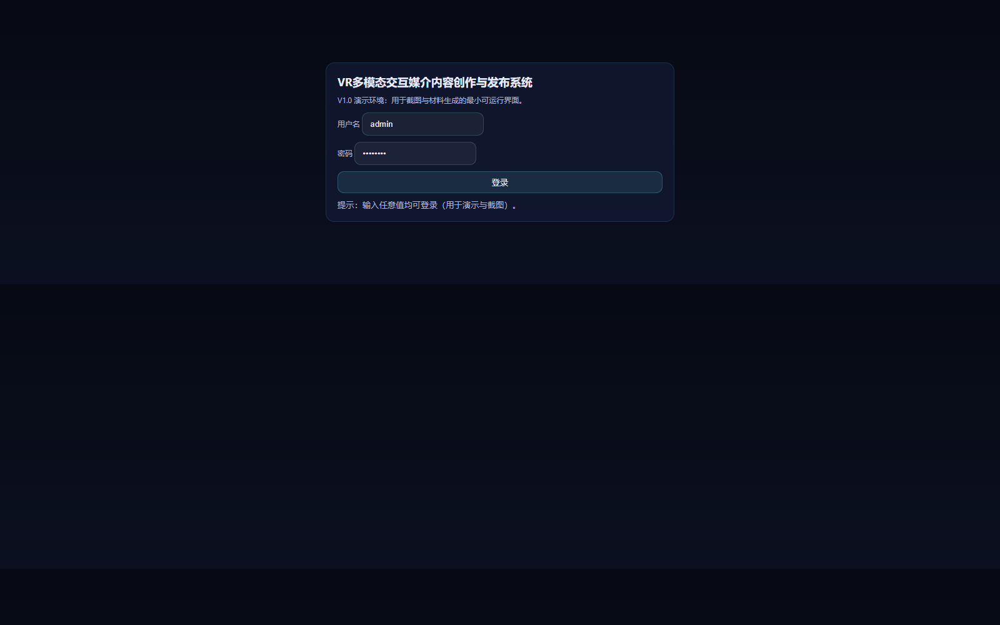
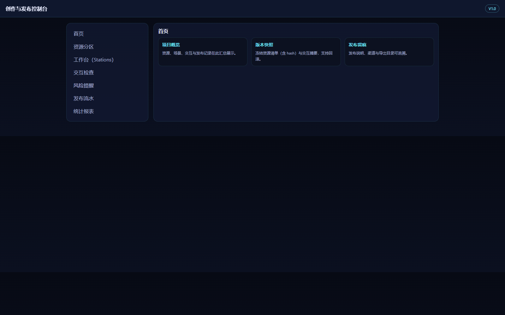
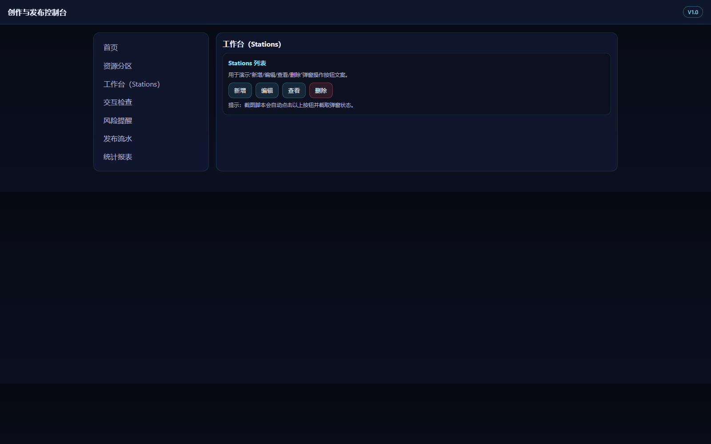
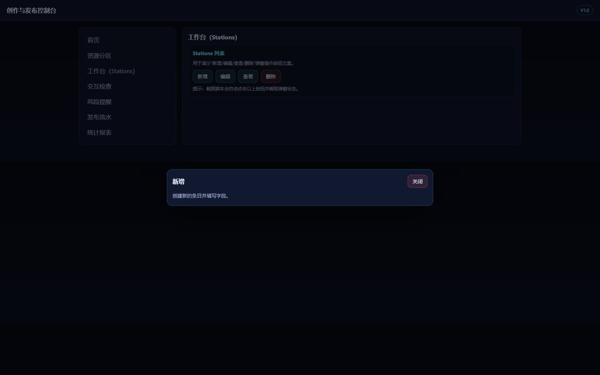
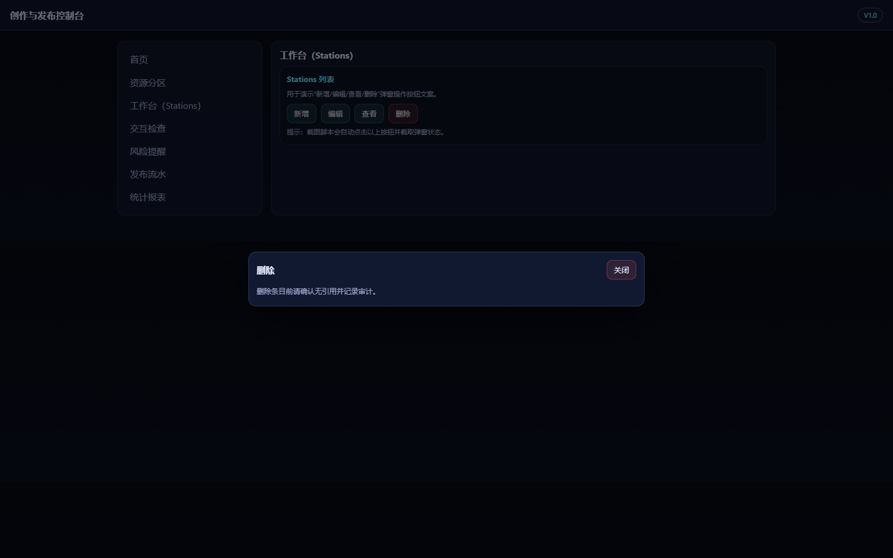
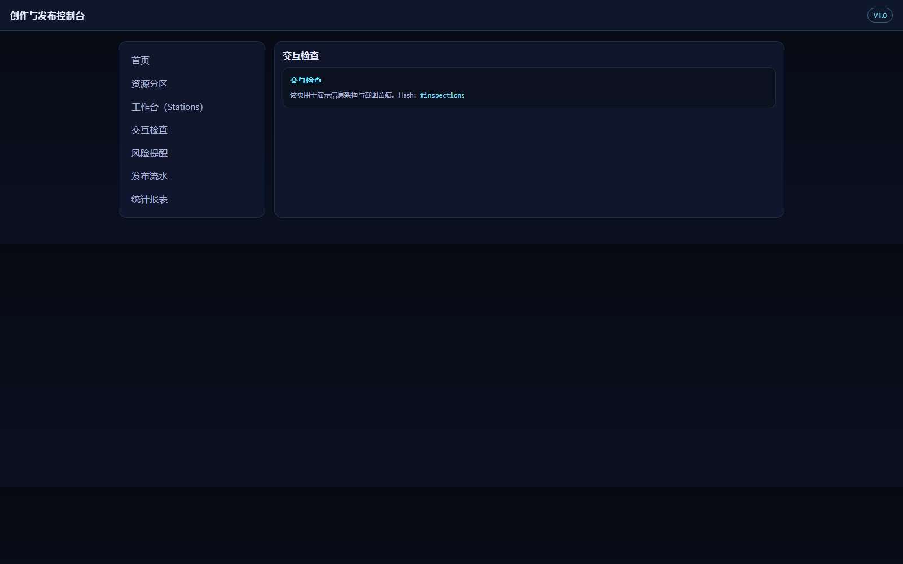
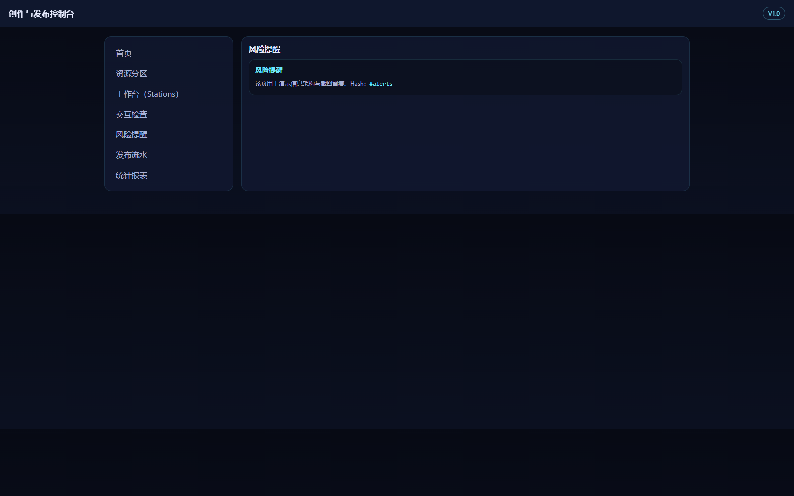
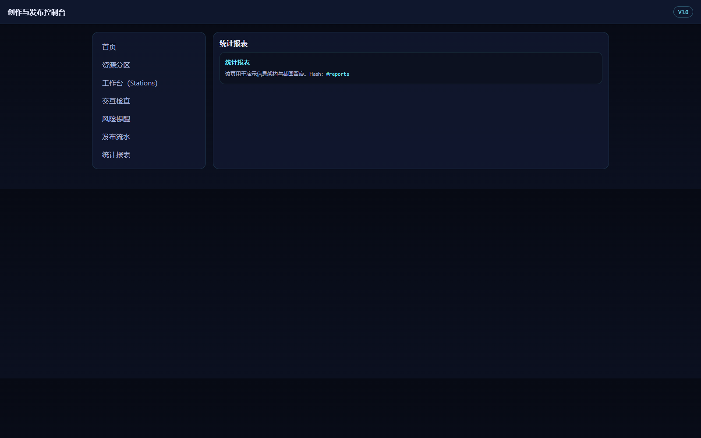

## 1. 文档定位与适用对象

本文档用于指导“VR多模态交互媒介内容创作与发布系统 V1.0”的日常使用，覆盖系统入口、登录、首页导航、核心模块页面访问、以及关键操作按钮（新增/编辑/查看/删除）的弹窗交互说明与截图留痕。本手册描述以本项目实际运行的 Web 控制台与 API 为准，不扩展到未实现的 VR 运行端播放器能力。

适用对象：
- 内容策划/编导：查看首页概览、进入交互检查与统计报表页面，进行评审与验收留痕。
- 资源维护人员：进入资源分区页面查看结构与说明，配合版本/发布流程完成交付准备。
- 交互/技术人员：验证服务可用性（/health），并对 Stations 页的弹窗操作进行核对。
- 管理员：确认页面入口可访问、关键按钮文案一致，并保留发布相关记录说明。

## 2. 系统入口与登录

### 2.1 登录界面总览

- 界面路径：运行后访问 `127.0.0.1:8010/`（端口以实际启动参数为准）
- 账号类型：演示账号（用于材料生成与截图留痕）
- 输入项：用户名、密码

图1-1 登录界面全图。展示系统标题、登录表单与输入区域。

### 2.2 登录操作步骤（连贯）

1. 打开系统入口，进入登录页。
2. 输入用户名 `admin` 与密码 `admin123`（演示环境允许任意输入，仅用于截图与材料留痕）。
3. 点击“登录”，页面跳转到首页。
4. 记录跳转结果：页面顶部出现“创作与发布控制台”标题，左侧导航可见。

## 3. 首页操作

### 3.1 首页布局与导航

- 顶部栏：页面标题“创作与发布控制台”、版本标识 `V1.0`
- 左侧栏：首页、资源分区、工作台（Stations）、交互检查、风险提醒、发布流水、统计报表
- 主内容区：概览卡片（项目概览、版本快照、发布留痕）用于说明系统关注点与后续扩展方向

图2-1 首页完整界面。需完整展示顶部栏、左侧导航与主内容区。

### 3.2 首页关键流程

1. 从登录页跳转到首页后，检查左侧导航是否完整显示。
2. 点击“资源分区”，进入 `#zones` 页面。
3. 点击“工作台（Stations）”，进入 `#stations` 页面。
4. 在 Stations 页执行一次“新增→关闭”弹窗流程，验证弹窗可见且关闭正常。
5. 返回首页，完成一次基本闭环验证与截图留痕。

## 4. 一级功能模块与操作说明

> 说明：本版本以“可交付可截图”为目标，模块页面主要用于展示信息架构与关键交互入口。以下内容以页面访问与按钮交互为主，不引入未实现的数据筛选、下拉框、复选框等复杂控件描述。

### 4.1 资源分区（Zones）

#### 4.1.1 页面访问与内容说明

1. 在左侧导航点击“资源分区”。
2. 页面跳转到 `#zones`，主内容区显示模块标题与说明。
3. 确认页面主体区域可见、文字清晰，便于后续扩展为“素材入库与分类”的工作区。

图3-1 资源分区页面。展示模块标题与页面主体区域。

### 4.2 工作台（Stations）

Stations 页用于演示“新增/编辑/查看/删除”四类关键动作的按钮文案与弹窗交互，是本手册的核心交互留痕点。

#### 4.2.1 页面访问与按钮区

1. 在左侧导航点击“工作台（Stations）”。
2. 页面跳转到 `#stations`，可见 Stations 列表卡片与按钮工具条。
3. 核对按钮文案必须包含：新增、编辑、查看、删除。

图3-2 Stations 页面。展示 Stations 卡片与按钮工具条区域。

#### 4.2.2 新增操作（界面确认）

1. 在 Stations 页面点击“新增”。
2. 系统弹出新增弹窗，展示操作标题与说明。
3. 阅读内容后点击“关闭”，弹窗消失并回到 Stations 页面。

图3-2a Stations 新增弹窗。展示弹窗标题“新增”与内容说明。

#### 4.2.3 编辑操作（界面确认）

1. 在 Stations 页面点击“编辑”。
2. 系统弹出编辑弹窗，展示操作标题与说明。
3. 点击“关闭”退出弹窗，返回 Stations 页面。

图3-2b Stations 编辑弹窗。展示弹窗标题“编辑”与内容说明。

#### 4.2.4 查看操作（界面确认）

1. 在 Stations 页面点击“查看”。
2. 系统弹出查看弹窗，展示操作标题与说明。
3. 点击“关闭”退出弹窗，返回 Stations 页面。

图3-2c Stations 查看弹窗。展示弹窗标题“查看”与内容说明。

#### 4.2.5 删除操作（确认提示）

1. 在 Stations 页面点击“删除”。
2. 系统弹出删除确认弹窗，提示删除风险与审计要求。
3. 点击“关闭”退出弹窗；在后续版本若接入真实数据，应提供二次确认与日志记录。

图3-2d Stations 删除弹窗。展示弹窗标题“删除”与提示内容。

### 4.3 交互检查（Inspections）

#### 4.3.1 页面访问

1. 在左侧导航点击“交互检查”。
2. 页面跳转到 `#inspections`，展示模块标题与说明。
3. 该模块用于后续扩展为“交互规则一致性检查、循环链路提示、缺失参数提示”等能力。

图3-3 交互检查页面。展示模块标题与页面主体区域。

### 4.4 风险提醒（Alerts）

#### 4.4.1 页面访问

1. 在左侧导航点击“风险提醒”。
2. 页面跳转到 `#alerts`，展示模块标题与说明。
3. 该模块用于后续扩展为“资源缺失、依赖不完整、版本冻结前检查”等提醒项列表。

图3-4 风险提醒页面。展示模块标题与页面主体区域。

### 4.5 发布流水（Irrigation）

#### 4.5.1 页面访问

1. 在左侧导航点击“发布流水”。
2. 页面跳转到 `#irrigation`，展示模块标题与说明。
3. 该模块用于后续扩展为“版本发布记录、渠道、导出目录、回滚原因”等留痕信息。

图3-5 发布流水页面。展示模块标题与页面主体区域。

### 4.6 统计报表（Reports）

#### 4.6.1 页面访问

1. 在左侧导航点击“统计报表”。
2. 页面跳转到 `#reports`，展示模块标题与说明。
3. 该模块用于后续扩展为“资源数量、交互数量、发布次数、验收完成度”等统计指标。

图3-6 统计报表页面。展示模块标题与页面主体区域。

### 4.7 页面元素与交互规则（可视化口径）

为保证后续扩展时界面与文档一致，本节给出本系统在“创作与发布控制台”风格下的页面元素与交互口径说明。该口径用于指导 UI 文案、按钮层级、提示语与交互反馈方式的统一，避免出现同一类操作在不同页面用不同按钮文字或不同反馈风格，从而影响截图一致性与审计可读性。

#### 4.7.1 按钮与动作层级

- 主按钮：用于关键推进动作（如“登录”“新增”“保存”“发布”），颜色与对比度应明显。
- 次按钮：用于非关键动作（如“查看详情”“返回”），不应抢占视觉注意力。
- 危险按钮：用于不可逆操作（如“删除”“回滚发布”），必须使用明显区分的颜色并附带确认提示。

按钮文案规则：
1. 文案使用动词开头，长度不超过 6 个汉字。
2. 同一动作跨页面保持一致：新增/编辑/查看/删除四类动作不使用同义替换词。
3. 危险动作必须在按钮附近给出风险提示文字或二次确认入口。

#### 4.7.2 交互与确认提示规则

本版本 Stations 页面已体现弹窗交互。后续扩展真实业务时，建议遵循如下规则：

1. 新增/编辑：弹窗包含必填项标识与校验提示，提交后给出成功提示并刷新列表。
2. 查看：弹窗展示只读信息，支持复制关键字段（如版本号、资源哈希）用于沟通。
3. 删除：弹窗展示确认提示与影响范围（是否存在引用），必须二次确认，并写入审计日志。

注意：文档中“弹窗/确认提示”的文字描述必须与截图一致，避免出现“描述了确认但截图无确认”的不一致问题。

#### 4.7.3 导航与页面跳转规则

- 左侧导航点击后，主内容区标题必须与导航项一致，便于截图与阅读对齐。
- 页面刷新或直接访问 hash（如 `/#stations`）时，应保持登录态或给出明确提示，避免进入空白页。
- 需要跨页面的操作（如从资源分区跳转到发布流水）应在手册中记录“起点—动作—终点—状态变化”，用于验收追溯。

## 5. 端到端操作流程演示

### 5.1 业务流程主线（示例）

1. 登录系统进入首页。
2. 从左侧导航依次进入：资源分区 → Stations → 交互检查 → 风险提醒 → 发布流水 → 统计报表。
3. 在 Stations 页面分别点击“新增/编辑/查看/删除”，观察弹窗是否正常显示与关闭。
4. 返回首页，完成一次端到端页面访问与关键交互留痕。

### 5.2 页面跳转与状态变化追踪

- 起点页面：登录页（图1-1）
- 操作动作：点击“登录”
- 目标页面：首页（图2-1）
- 状态变化：左侧导航出现；可进入模块页面并触发弹窗交互

### 5.3 操作要点与字段口径（用于扩展与验收）

本节用于说明在后续补齐“资源/场景/交互/版本/发布”真实数据功能时，界面与接口字段建议遵循的口径。该说明不等同于已实现功能承诺，仅作为验收记录中对“字段含义与边界”的统一约定，避免后续扩展时出现同名字段含义不一致的问题。

#### 5.3.1 资源条目（Asset）建议字段

- `type`：资源类型（model/texture/audio/video/ui）。用于决定预览方式与导出策略。
- `filename`：原始文件名。用于追溯来源与定位原始素材。
- `sha256`：文件哈希。用于去重与交付一致性校验（同一版本导出清单必须稳定）。
- `tags`：标签集合。用于按场景、用途、版本、来源进行分类检索。
- `meta_json`：元数据（可选）。例如时长、分辨率、纹理尺寸、面数等信息。

验收关注点：
1. 新增资源后，列表中应出现该条目，且 `sha256/size` 等字段一致。
2. 编辑资源说明/标签后，列表刷新应可见变更。
3. 删除资源前若存在引用关系，应给出提示并要求二次确认。

#### 5.3.2 场景节点（SceneNode）建议字段

- `node_type`：节点类型（容器/道具/UI/音源/触发器容器）。用于决定可编辑属性集合。
- `transform_json`：位置/旋转/缩放（或占位结构）。用于与运行端坐标系统对接。
- `asset_ref_id`：资源引用 id。用于建立“节点—资源”依赖关系。
- `props_json`：节点扩展属性。例如可交互标记、提示文案、碰撞体参数等。

验收关注点：
1. 新增节点后，树结构应正确更新，且支持拖拽排序或上移/下移。
2. 编辑节点名称与类型后，属性面板应同步更新。
3. 删除节点前若存在子节点或交互引用，应提示风险并要求确认。

#### 5.3.3 交互规则（InteractionGraph）建议字段

交互规则建议采用“事件—条件—动作”结构，便于导出为 JSON 并由运行端适配：
- 事件：进入区域、点击、凝视、手势、语音命令、时间到达、变量变化
- 条件：变量判断、权限判断、资源就绪、冷却时间
- 动作：播放动画/音频、切换场景、显示 UI、写入变量、触发导出

验收关注点：
1. 新增规则后可在列表中检索到，且可启用/禁用。
2. 编辑规则后，预览摘要应能提示缺失参数或潜在循环链路。
3. 删除规则前应提示其引用范围，避免误删导致版本不可用。

#### 5.3.4 版本与发布（Version/Publish）建议字段

- 版本号：如 `V1.0.0`、`V1.0.1`，用于冻结一次可交付快照。
- 资源清单：每次冻结版本必须记录资源列表与哈希，保证“同版本同清单”。
- 发布记录：记录版本、渠道、说明、导出目录，支持回滚与原因说明。

验收关注点：
1. 生成版本后，对比两个版本应能看到资源与交互摘要的差异。
2. 发布后应出现发布记录条目，包含说明与时间戳。
3. 回滚发布必须留下回滚原因，并保留历史记录不可篡改。

## 6. 附录

### 6.1 常见问题

- 无法访问页面：检查服务是否启动、端口是否占用、Windows 防火墙是否拦截本地端口。
- 登录后无法跳转：刷新页面后重试；若问题持续，检查浏览器是否禁用本地存储。
- 弹窗无法显示：确认 Stations 页面按钮区域可见；若仍异常，检查前端脚本是否被浏览器插件拦截。
### 6.2 运行与访问说明

1. 启动服务：在项目目录运行启动命令后，等待控制台输出“服务已启动/Listening”等提示。
2. 访问入口：使用浏览器访问 `127.0.0.1:8010/` 进入登录页；若端口不同以启动参数为准。
3. 健康检查：访问 `127.0.0.1:8010/health`，返回 `{"status":"ok"}` 说明后端可用。
4. 常见端口冲突：若提示端口被占用，修改启动端口或结束占用进程后重试。

### 6.3 页面操作细节补充

- 返回与刷新：当页面状态未按预期更新时，可优先点击导航重新进入页面，或使用浏览器刷新。
- 弹窗关闭：Stations 等页面弹窗支持“取消/关闭”按钮关闭；关闭后应返回原页面并保持导航选中态。
- 输入与校验：弹窗表单若出现必填提示，应补齐后再提交；提交失败时记录提示文本便于排查。

### 6.4 截图生成与复核

1. 截图必须来自真实运行界面，且包含顶部栏与左侧导航，避免被误判为静态素材。
2. 每张截图都应有图题说明（“图X-Y 描述”），并与图片内容一一对应。
3. 若截图中文字过小，可在不改变信息架构的前提下适当调整浏览器缩放后重截，以保证 PDF 可读性。

### 6.5 角色视角的操作要点

- 内容策划/编导：重点关注“资源分区→工作台→交互检查→统计报表”的浏览顺序，确保每个模块入口可访问、信息可读、截图可留痕。
- 资源维护人员：进入资源分区后，应能清晰理解分类结构与命名；在 Stations 页面通过“新增/编辑/查看/删除”演示闭环确认交互一致性。
- 管理员：核对导航项命名、按钮文案、弹窗标题与提示语的一致性；对“删除”类操作必须出现确认提示，避免误操作。

### 6.6 提交/删除操作的复核清单

1. 新增：打开弹窗→填写必要信息→确认提交→弹窗关闭→列表或提示信息发生变化。
2. 编辑：选中条目→打开弹窗→修改信息→保存→返回后可见更新结果。
3. 查看：打开弹窗→检查关键信息展示完整→关闭后返回列表。
4. 删除：触发删除→出现二次确认→确认后条目消失或提示删除成功；若禁止删除应有明确提示。

### 6.7 常见故障排查（补充）

- 页面空白：打开浏览器开发者工具查看控制台报错；刷新后重试，仍失败则确认服务端 `/health` 是否正常。
- 图片不显示：检查 `images/` 目录是否存在对应文件名；确认 Markdown 引用路径形如 `images/xxx.png`。
- PDF 排版异常：优先以 docx 为准核对封面、页眉页码、图题；必要时重新生成 docx 后再导出 PDF。
- 文档不一致：若软件全称/版本号在三件套中不一致，必须先统一后再重新生成全部产物，避免交付被退回。

### 6.8 补充说明（打印与归档）

- 打印建议：导出 PDF 后以 100% 比例预览，检查页眉页码、图题与正文是否被截断；必要时调整浏览器缩放重新导出。
- 归档建议：交付时将 `md/docx/pdf/images/` 放在同一目录下归档，避免图片路径断裂导致复核失败。
- 一致性提示：若重新截图或修改按钮文案，需同步更新对应图题与相关段落说明，确保三件套一致。

### 6.9 补充说明（接口与数据验证）

为保证手册描述与系统实现一致，建议在生成截图与材料前完成一次最小验证：
1. 登录页可访问，输入任意账号后能进入首页；
2. 首页与左侧导航可正常切换到各模块页面；
3. 对包含弹窗操作的页面（如 Stations），至少完成一次“打开弹窗→取消/关闭→返回原页”的闭环；
4. 调用健康检查接口 `/health` 返回 `{"status":"ok"}`；
5. 若系统提供列表数据或示例数据，确认页面展示不为空且不会报错。
数据与截图一致性：
- 若截图展示了按钮文案、标题或提示语，手册对应段落需使用相同措辞；
- 若后续调整 UI 主题色或布局，应重新截图并替换图片文件，避免材料前后不一致。
