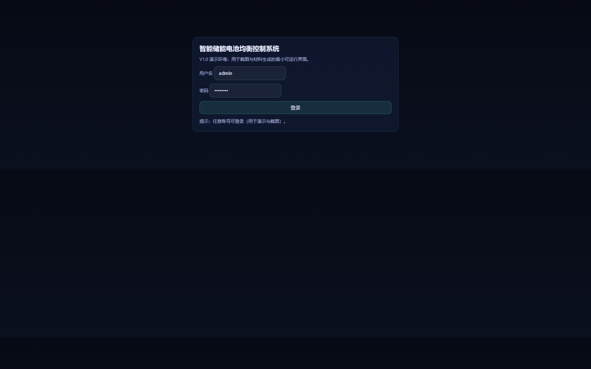
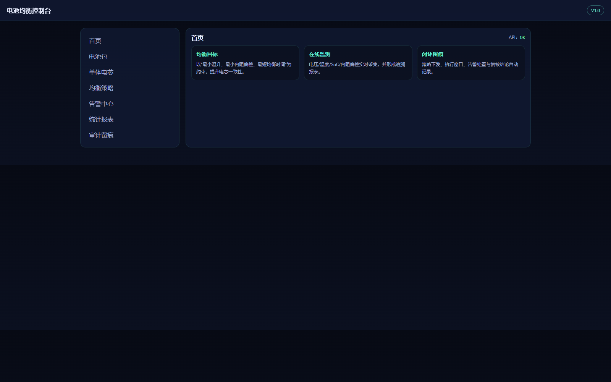
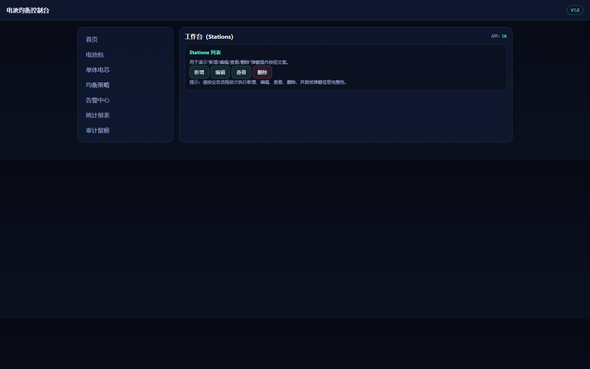
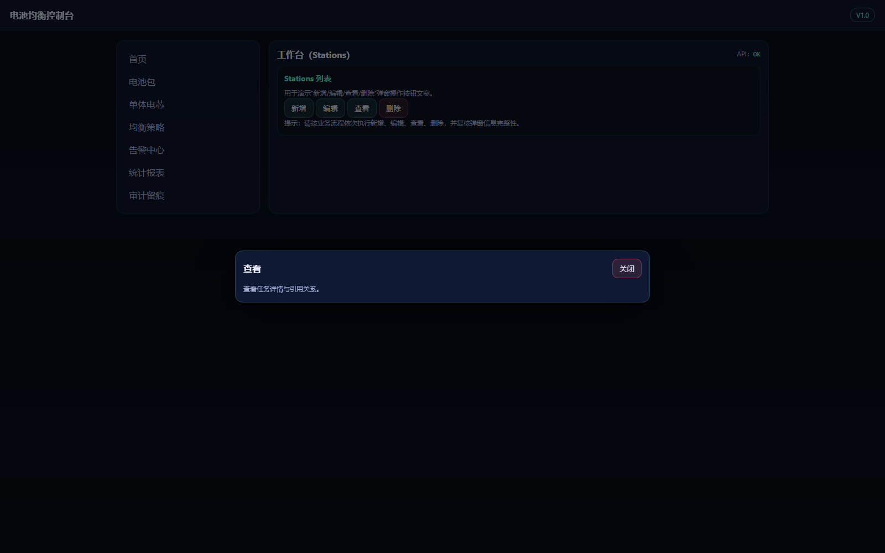
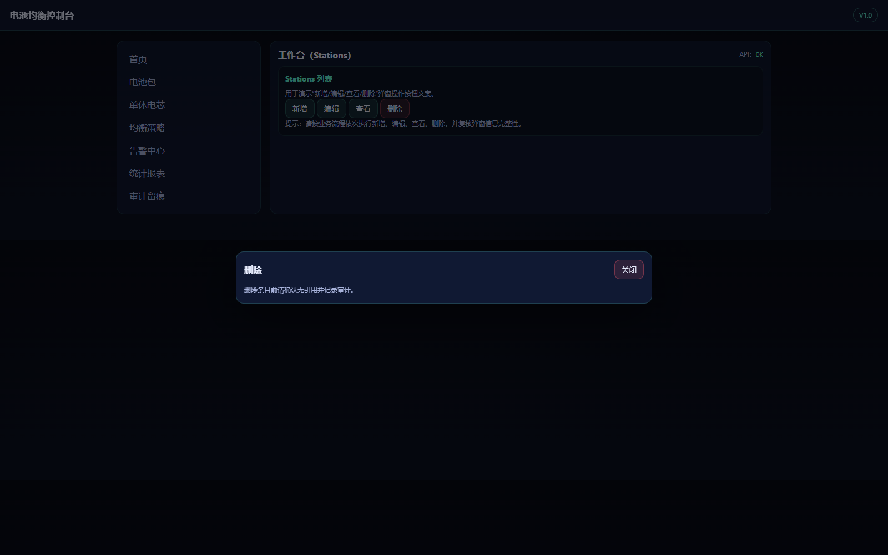
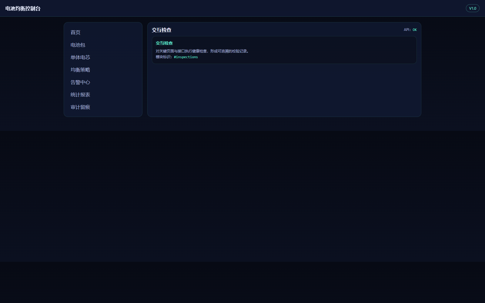

## 1. 文档定位与适用对象

### 1.1 文档定位
本手册用于指导站端运维、值班与管理人员完成电池包建档、采样、均衡策略配置、执行监控与告警处置。文档重点覆盖系统核心流程、关键字段口径、操作前置条件与异常处理路径，确保不同岗位能够按统一标准执行业务。

### 1.2 适用对象
- 运维人员：巡检、采样、校准、维护
- 值班人员：告警确认、策略下发、执行监控
- 管理人员：阈值模板、权限、审计与版本治理

### 1.3 阅读建议
首次使用建议按“系统入口与登录 → 首页操作 → 一级功能模块 → 端到端流程”顺序阅读；日常复盘建议重点查看第 4 章与第 5 章。

## 2. 系统入口与登录

### 2.1 登录入口
在浏览器访问系统地址后进入登录页，输入账号密码登录。若企业已部署统一认证，请使用平台分配账号，并确认账号已被授予对应角色。

### 2.2 登录前检查
登录前应确认以下条件：
1) 当前工作站可访问系统网络地址；
2) 时间已与服务器对时，避免审计时间戳偏差；
3) 现场采样网关在线，避免登录后首页数据全部为空。

图1-1 登录页全屏截图

### 2.3 登录后首页
登录成功进入首页，展示均衡目标、在线监测与闭环留痕。首页是值班人员的主工作面板，建议先查看 API 状态与风险提醒数量，再进入具体模块处理。

### 2.4 角色登录差异
不同角色登录后虽进入同一首页，但可见操作与按钮存在差异：运维角色以采样与维护入口为主，值班角色以告警与策略执行入口为主，管理员角色包含模板治理与审计复核入口。建议管理员定期抽样检查权限边界，避免出现越权操作。

### 2.5 登录安全建议
生产环境应启用复杂口令策略、账号锁定策略与异地登录提醒。若发现同账号在短时间内多地登录，应立即暂停该账号并由管理员进行复核。系统日志中所有登录事件都会记录登录时间、来源地址与结果状态，可用于安全审计。

### 2.6 登录失败处置流程
当出现连续登录失败时，建议按以下顺序排查：
1) 核验账号状态是否禁用或过期；
2) 核验认证服务是否可用；
3) 核验网络链路与 DNS 解析；
4) 核验浏览器缓存是否导致旧会话冲突。
完成排查后应在值班记录中保留“故障现象、处理动作、恢复时间、影响范围”四项信息，作为后续安全审计和运维复盘依据。

图2-1 首页全屏截图

## 3. 首页操作

### 3.1 首页信息解读
首页卡片用于概览均衡目标、在线监测与闭环留痕，值班员应优先检查 API 状态与风险提醒入口。若 API 状态异常，应先排查服务运行状态，避免在数据不完整的情况下误下发策略。

### 3.2 常用入口
- 资源分区：定位站点/柜/簇
- 工作台：创建均衡任务
- 风险提醒：确认处置路径

### 3.3 首页值班建议
每个班次建议执行三步检查：
1) 检查昨日遗留告警是否全部闭环；
2) 检查当日采样计划是否已执行；
3) 检查当前策略版本是否与调度计划一致。

### 3.4 首页指标解释
首页核心指标通常包含“风险任务数、执行中任务数、已闭环告警数、近 24 小时平均电压差与温升趋势”。当风险任务数高但执行中任务数低时，说明处置可能存在滞后；当平均电压差长期不下降时，说明当前策略模板可能与现场工况不匹配，应组织复盘。

### 3.5 班次交接建议
交接前建议在首页导出当班快照，并在交接记录中明确三项内容：未闭环风险、进行中任务、待复核处置。交接后由接班人员复核关键数据是否一致，若存在差异应立即标注并排查数据来源。

### 3.6 首页巡检标准
建议建立统一巡检标准，至少覆盖以下项目：
- 数据完整性：关键指标是否存在空值、异常值、延迟值；
- 指标阈值：高风险指标是否达到预警/严重阈值；
- 模块可用性：导航切换、弹窗交互、查询筛选是否正常；
- 审计留痕：关键动作是否按要求写入审计日志。
每次巡检完成后，应由执行人签名并提交巡检结果，确保问题可追溯。

## 4. 一级功能模块与二级菜单操作

### 4.1 资源分区
用于按站点/柜/电池簇组织资产，支撑分区统计与权限隔离。资源分区建立后，可在后续任务中直接按分区筛选对象，降低误操作概率。

#### 4.1.1 新建分区
新建时应明确站点、设备层级与命名规则，建议命名包含“站点简称 + 柜号 + 簇号”，例如 `HZ-A01-C03`。

#### 4.1.2 分区维护
当资产迁移或设备更换时，应先冻结旧分区、再迁移关联任务，最后启用新分区，避免历史报表断链。

图3-1 资源分区页面

### 4.2 工作台（Stations）
用于创建均衡任务并在任务维度进行编辑、查看与删除。工作台是策略执行前的核心控制入口，所有任务操作都会写入审计记录。

#### 4.2.1 新增任务
新增任务时需填写任务名称、目标电池包、采样窗口、策略模板和执行时段。建议任务名称包含“日期 + 分区 + 目标类型”，便于检索。

图3-2 工作台页面

图3-2a 新增弹窗

#### 4.2.2 编辑与查看
编辑时重点关注温升上限、电压差阈值、最大占空比等参数；查看页面用于复核任务上下文与历史变更。

图3-2b 编辑弹窗

图3-2c 查看弹窗

#### 4.2.3 删除前复核
删除仅适用于未执行且无下游引用任务。若任务已执行，建议改为“归档 + 备注原因”，避免审计链断裂。

图3-2d 删除弹窗

#### 4.2.4 参数配置建议
对于不同运行工况建议使用不同模板：
- 常规工况：以稳定性优先，采用保守阈值；
- 峰值工况：以安全约束优先，缩短执行窗口并降低占空比；
- 异常工况：先做风险隔离，再执行试探性均衡。
参数调整应遵循“先小步、后放大”的原则，每次调整后都要观察至少一个完整采样周期。

### 4.3 交互检查
用于校验页面与接口关键路径可用性，并为审计留痕提供校验记录。系统升级或网络变更后，应优先执行交互检查。

图3-3 交互检查页面

#### 4.3.1 检查项建议
建议至少覆盖以下检查项：登录接口可用性、任务创建接口可用性、报表导出接口可用性、告警列表加载时延。对于延迟敏感接口，应设定阈值并在超阈时触发预警。

#### 4.3.2 失败处理
若交互检查失败，应先确认依赖服务状态，再确认网络与鉴权信息，最后结合日志定位具体错误点。处理完成后必须重新执行检查，避免“修复未验证”直接恢复业务。

### 4.4 风险提醒
对电压差、温升、内阻漂移、采样缺失等风险给出提醒并形成处置记录。风险项应在同一班次内完成初次确认。

图3-4 风险提醒页面

#### 4.4.1 风险分级
建议将风险分为提示、预警、严重三级。提示级用于观察，预警级需要在班次内处置，严重级需立即执行保护动作并上报。分级策略应与现场安全规程保持一致。

#### 4.4.2 闭环要求
每条风险在关闭前应具备“确认人、处置动作、复核结论、时间戳”四项记录。缺少任一项都不应视为闭环完成。

#### 4.4.3 升级上报机制
当风险等级达到严重级，或同一设备在短时间内重复出现同类风险时，应触发升级上报：
1) 立即通知值班负责人；
2) 进入保护策略或停用策略；
3) 启动多岗位会审；
4) 明确恢复条件后再恢复业务。
升级过程必须全程留痕，避免口头决策无法追踪。

### 4.5 发布流水
均衡策略与任务执行的发布记录，可按版本回溯。每次下发后建议记录“下发人、变更原因、预期效果、回滚条件”。

图3-5 发布流水页面

### 4.6 统计报表
用于导出均衡效果、告警处置与审计摘要，支撑验收与复核。导出报表前应先锁定统计区间，避免跨班次数据混入。

图3-6 统计报表页面

## 5. 端到端操作流程演示

### 5.1 新建均衡任务并执行
1) 在工作台点击“新增”创建任务；
2) 选择包号与采样窗口并确认样本完整性；
3) 选择策略模板并保存；
4) 在发布流水确认下发记录；
5) 观察风险提醒是否清零；
6) 在统计报表导出执行结果，作为班次留痕。

### 5.2 告警处置闭环
1) 在风险提醒确认告警级别；
2) 根据温升与电压差选择处置路径（观察/降载/停用）；
3) 生成处置报告并通知相关岗位；
4) 管理员在审计留痕复核并归档。

### 5.3 回滚与复盘
当执行效果不达预期时，按发布流水回滚到上一个稳定版本，复盘内容至少包含：阈值设置、环境因素、执行窗口、异常点及改进建议。

### 5.4 周期性治理流程
建议按“日检、周检、月检”建立治理节奏。日检关注告警闭环与任务执行；周检关注策略效果与阈值适配；月检关注设备健康趋势与模板重构。通过周期性治理可减少临时性紧急处置，提升系统稳定性。

### 5.5 典型问题复盘模板
每次重大异常建议按统一模板复盘：
- 现象：何时、何地、何对象出现异常；
- 影响：是否影响安全或业务连续性；
- 根因：数据、策略、设备或流程问题；
- 处置：采取了哪些动作；
- 预防：后续如何避免再发。
统一模板有助于沉淀组织经验并提升跨班组协作效率。

### 5.6 端到端质量验收要点
一次完整流程执行后，建议按“数据、策略、执行、审计、报表”五个维度验收：
1) 数据维度：采样时间连续、关键字段齐全、无明显异常跳变；
2) 策略维度：模板来源清晰、参数变更有审批记录；
3) 执行维度：任务状态闭环、异常处置有结论；
4) 审计维度：关键动作有责任人和时间戳；
5) 报表维度：输出结果可复核、可追溯。
仅当五个维度均满足标准时，方可判定流程完成质量达标。

### 5.7 运行改进建议
建议每周对执行结果做一次趋势分析，关注电压差收敛速度、温升控制效果与告警复发率。若某类问题连续两周未改善，应组织专项优化，调整模板参数、执行窗口或现场维护策略，并在次周复盘中验证改进效果。

## 6. 附录

### 6.1 字段口径

- 电压差：同一电池包内最大电芯电压与最小电芯电压之差。

- 温升：采样窗口内温度变化量，用于限制均衡强度。

- 内阻漂移：相对基线内阻的偏差，用于识别老化与风险单体。

### 6.2 异常处理速查
- 采样缺失：检查采样窗口与网络连通性，必要时重启采集进程。
- 温升异常：降低均衡强度或暂停均衡，复核散热与风道。
- 电压差不收敛：检查单体一致性与连接件压降，必要时更换风险单体。

### 6.3 运行环境与访问检查

1. 启动服务：在项目目录执行启动命令，确认控制台输出服务监听信息。
2. 访问入口：通过系统部署地址进入登录页，地址与端口以部署配置为准。
3. 健康检查：调用健康检查接口并确认返回正常状态。
4. 端口冲突处理：若端口被占用，先释放冲突进程后再重试。

### 6.4 交付一致性复核

1. 术语一致：软件全称、版本号、模块名称在 PRD、操作手册、源代码文档中保持一致。
2. 图片一致：图片编号、图题说明与页面内容保持一一对应。
3. 功能一致：手册描述仅覆盖系统已实现功能，不引入未实现流程。
4. 归档一致：md/docx/pdf 与 images 目录保持同批次生成时间。
