## 1 文档定位与适用对象
### 1.1 文档说明
本文档用于指导园林景观设计师、评审人（甲方/专家）与管理员使用“方案三维可视化表达 + 版本评审闭环 + 清单导出”能力。文档内容以当前演示版实现为准，描述的页面与按钮均可在系统界面中找到对应入口。

软件全称：园林景观三维可视化设计平台 V1.0

### 1.2 适用对象
- 设计师：创建场地、进入方案工作台，完成季相切换、植物库维护、材料查看与清单导出。
- 评审人：在评审中心查看版本要点与评审事项清单，基于截图提出意见并跟踪状态。
- 管理员：确认系统入口与演示账号可用；在实际部署中负责账号与字典维护。

## 2 系统入口与登录
### 2.1 访问入口
演示版采用“前端静态页面 + Python 内置 HTTP 服务”方式运行：
- 前端页面：`apps/web/index.html`
- API 健康检查：`GET /api/health`
- 登录接口：`POST /api/auth/login`

### 2.2 登录
1) 打开系统首页后，会默认进入登录界面。  
2) 输入账号与密码，点击“登录”。  
3) 登录成功后进入“方案总览”页，右上角显示当前角色信息。  

演示账号与密码：
- 管理员：`admin / admin123`
- 设计师：`designer / design123`
- 评审人：`reviewer / review123`

代码定位证据：`apps/api/main.py` `POST /api/auth/login`；`apps/web/app.js` `apiLogin` 与 `bindLogin`

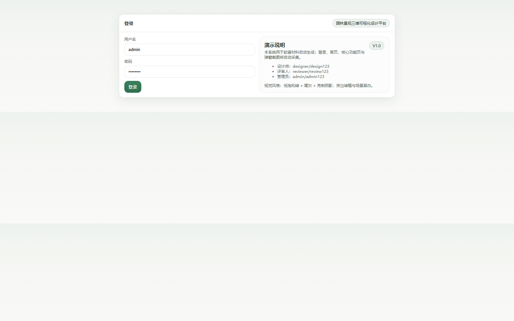

## 3 首页（方案总览）
### 3.1 首页用途
首页用于汇总“场地、版本、评审事项与清单导出”的主要入口，避免用户在多个菜单中反复查找。

页面包含：
- 快速入口：场地、方案、评审、导出
- 关键指标：场地数量、方案版本、植物品种数、评审事项数

代码定位证据：`apps/web/app.js` `views.home`

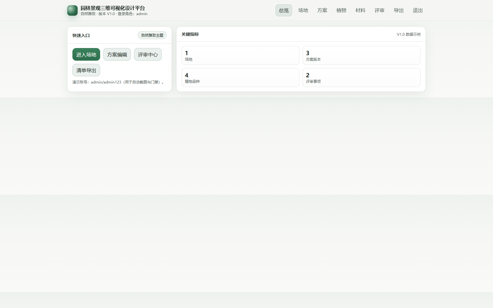

## 4 场地与底图
### 4.1 场地信息查看
进入“场地”页后，可看到场地名称、位置、比例尺标定口径等信息。V1.0 演示版以“底图与标定说明卡片”呈现场地基准，便于在评审阶段明确坐标口径。

字段口径（演示）：
- 场地名称：用于区分项目内不同场地。
- 位置：文字描述，用于方案汇报归档。
- 比例尺标定：通过两点测距得到“像素—米”换算关系（演示版展示固定口径）。

代码定位证据：`apps/web/app.js` `views.site`

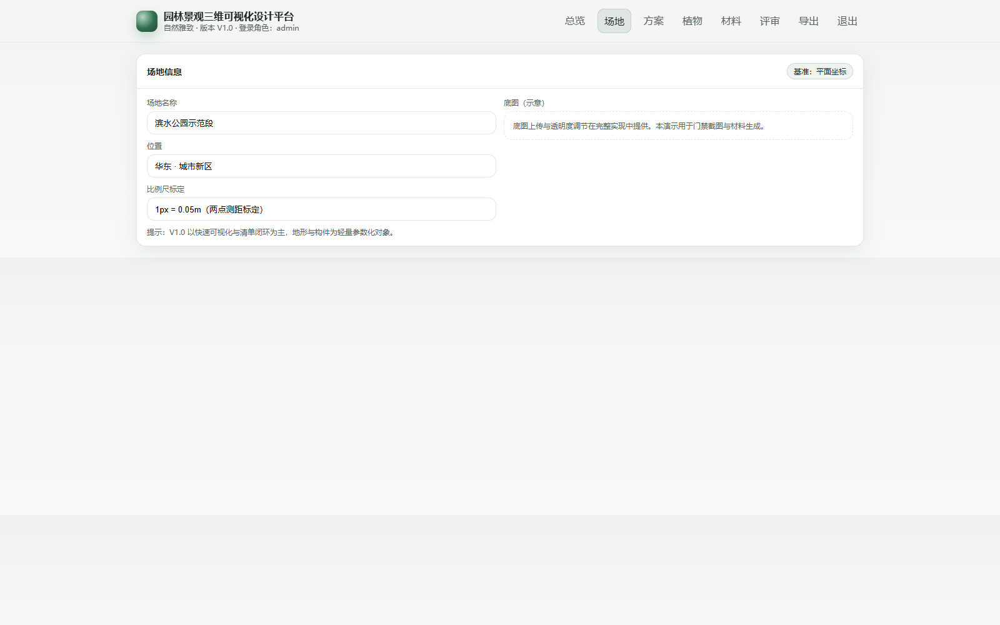

## 5 方案编辑（演示口径）
### 5.1 编辑面板与季相切换
进入“方案”页后，页面提供季相切换按钮与要素清单。V1.0 演示版将真实 WebGL 三维视窗以“场景要素表格”形式替代，用于支撑软著截图、文档一致性与清单闭环说明。

操作步骤：
1) 点击“切换季节”，季相在 春/夏/秋/冬 间循环。  
2) 观察“季相”标识变化，用于表达季相对植物表现色板的影响（演示口径）。  
3) 点击“植物”“材料”进入对应功能页。  

代码定位证据：`apps/web/app.js` `views.plan` `bind`（季相切换）

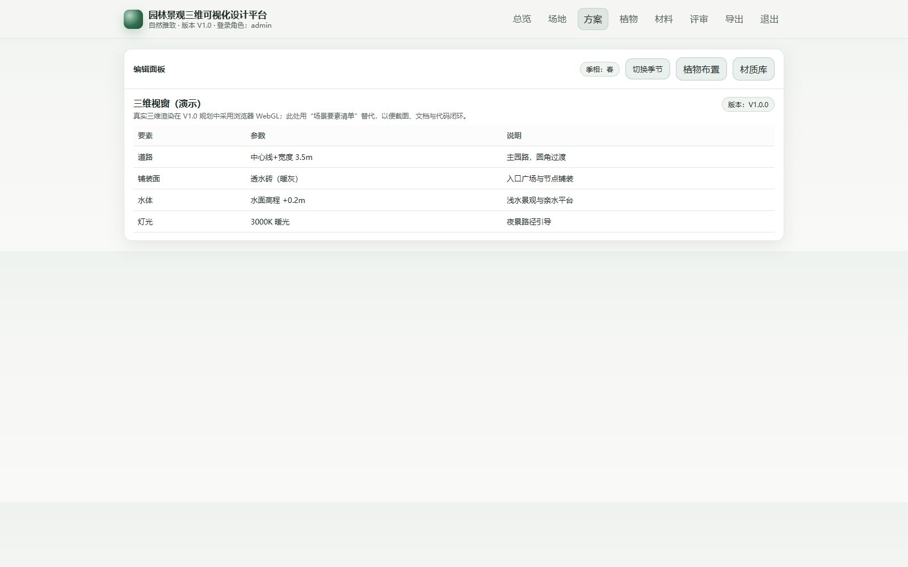

## 6 植物库与布置
### 6.1 植物库列表
进入“植物”页后，可查看植物库列表（编号、中文名、类别、常绿/落叶、冠幅、季相要点）。该列表是“清单导出”的数据依据之一，也是评审意见中最常被引用的对象。

代码定位证据：`apps/web/app.js` `views.planting`（表格渲染）

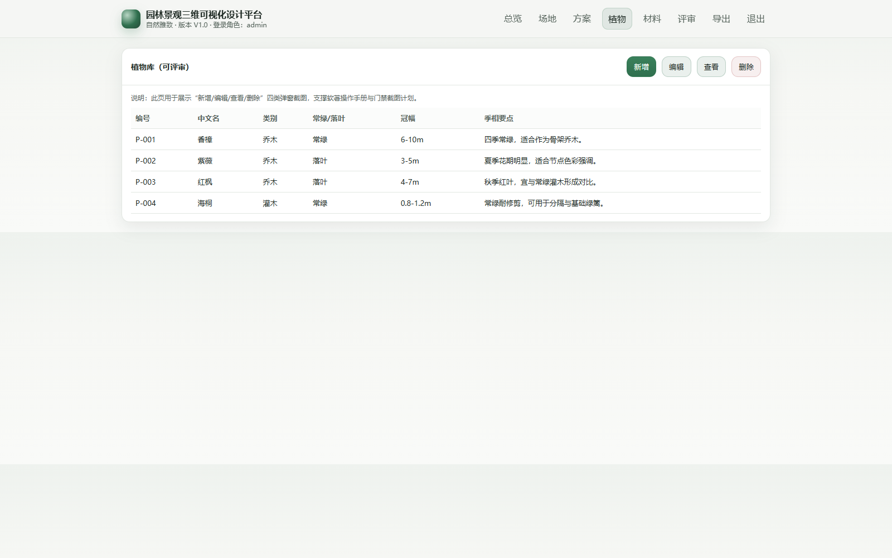

### 6.2 新增植物
1) 点击“新增”。  
2) 系统弹出“新增植物品种”窗口。  
3) 在后续扩展中，此处将写入植物字典并更新清单。演示版用于说明字段口径与截图留存。  

代码定位证据：`apps/web/app.js` `openPlantModal('create')`；`window.__rkModal.closeModal`

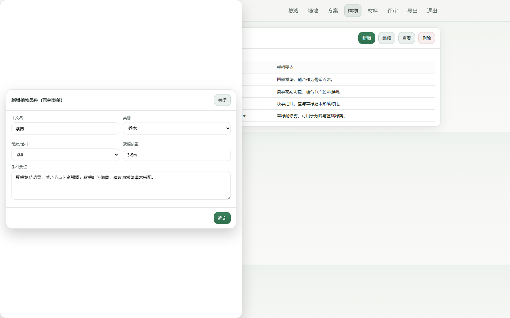

### 6.3 编辑植物
1) 点击“编辑”。  
2) 系统弹出“编辑植物信息”窗口。  
3) 修改字段后点击“确定”关闭弹窗（演示版不做真实保存）。  

代码定位证据：`apps/web/app.js` `openPlantModal('edit')`

### 6.4 查看植物
1) 点击“查看”。  
2) 弹窗进入只读状态，用于评审阶段快速核对字段。  

代码定位证据：`apps/web/app.js` `openPlantModal('view')`

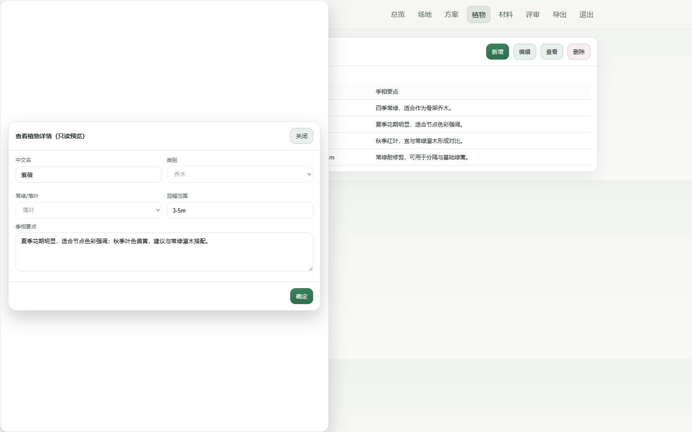

### 6.5 删除植物
1) 点击“删除”。  
2) 系统弹出删除确认窗口。  
3) 点击“确认删除”后关闭弹窗（演示版不做真实删除）。  

代码定位证据：`apps/web/app.js` `openPlantModal('delete')`

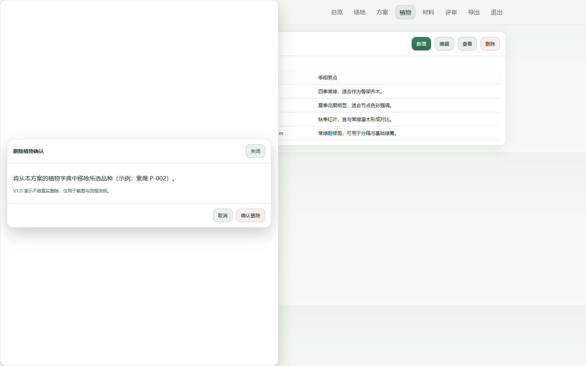

## 7 材料与铺装
### 7.1 材料字典查看
“材料”页用于展示铺装与构筑物材质条目（编号、名称、单位、用途）。在真实落地中，材料可与铺装面对象绑定并自动汇总用量；V1.0 演示版以表格呈现字段与口径。

代码定位证据：`apps/web/app.js` `views.materials`

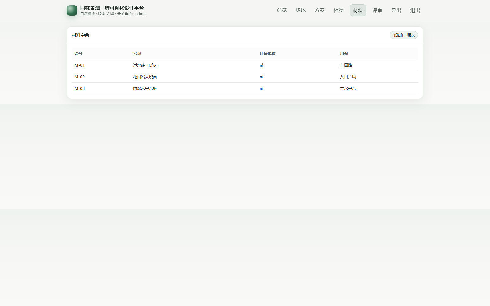

## 8 评审中心
### 8.1 评审事项列表
评审中心以“事项列表”方式呈现版本评审的主要问题，字段包含编号、标题、标签、优先级、状态。V1.0 的状态流为：新建 / 处理中 / 已解决 / 已关闭。

代码定位证据：`apps/web/app.js` `views.review`

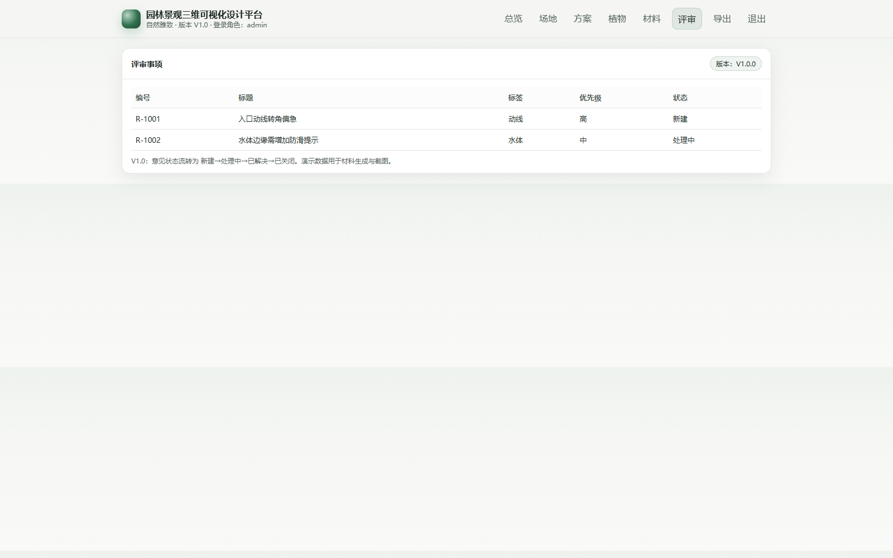

### 8.2 评审建议（演示口径）
在评审过程中，建议把意见写到具体对象与范围（例如“入口动线转角”“水体边缘防滑提示”），并在版本发布时记录变更摘要，便于后续追溯“为什么改、改了什么、影响哪些清单”。

## 9 清单导出
### 9.1 导出植物清单
1) 进入“导出”页。  
2) 点击“导出植物清单”。  
3) 系统在页面下方输出 CSV 文本，可复制保存为 `.csv` 文件。  

### 9.2 导出材料清单与灯具清单
与植物清单相同，分别点击“导出材料清单”“导出灯具清单”，即可在下方得到对应 CSV 内容。演示版的灯具清单包含色温、功率与数量字段。

代码定位证据：`apps/web/app.js` `views.export` `bind`

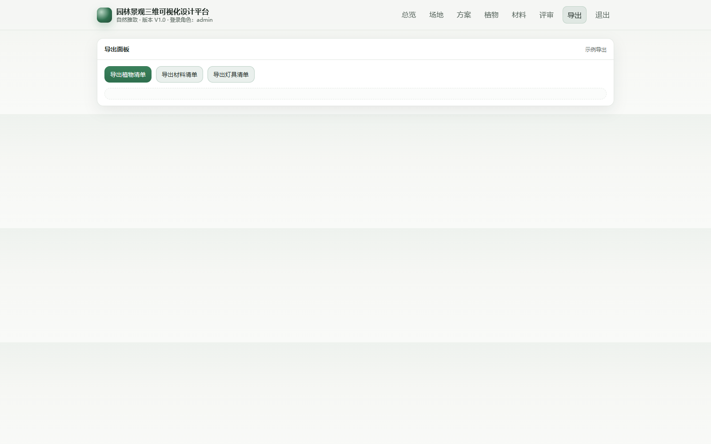

## 10 常见问题（演示）
### 10.1 登录后仍停留在登录页
请确认浏览器允许本地存储（LocalStorage）。演示版登录成功后会把 token 写入 `g3d_token` 并跳转到 `#home`。

### 10.2 截图缺失或空白
软著材料生成阶段会自动启动本地服务并通过自动化脚本采集截图。若截图失败，需要确认：
- Edge 可执行文件存在（默认路径由公共脚本配置）
- Playwright 已安装且可用（位于 `E:\\copyRight\\workspace\\node_modules`）

## 11 业务流程与口径补充（用于评审与交付一致性）
本节用于把“页面看到的内容”与“清单/评审/版本”的口径对齐，避免在汇报或交付时出现同一术语在不同材料中含义不一致。

### 11.1 场地、方案与版本的关系
- 场地：空间容器，描述底图、比例尺与北向等基准信息。  
- 方案：在同一场地下的一套设计成果，包含道路、铺装、水体、构筑物、灯光与植物等要素。  
- 版本：方案的发布快照。评审应绑定到具体版本，避免“评审意见指向不明确”。  

演示版口径：
- 页面右上角“版本：V1.0.0”用于表述当前快照编号；
- “评审中心”默认展示该版本的事项列表。

### 11.2 季相预览的含义（演示口径）
季相预览用于表达植物在不同季节的视觉差异（例如春花、夏荫、秋色、冬骨架）。演示版通过“季相标签”与字段说明体现季相概念，便于在软著申请表与操作手册中说明“季相可视化”能力。

建议在实际项目中的口径：
- 季相影响表现色板与叶量参数；
- 清单统计（数量/面积/点位）不因季相切换而变化；
- 版本发布时可记录“本版本重点季相：秋季红叶效果”作为摘要。

### 11.3 植物库字段口径
植物库列表字段含义如下：
- 编号：用于清单导出与版本对比的稳定 ID。  
- 中文名：用于项目沟通的主名称。  
- 类别：乔木/灌木/地被，用于分层布置与维护组织。  
- 常绿/落叶：影响冬季景观与维护策略。  
- 冠幅：用于估算遮荫范围与空间尺度控制。  
- 季相要点：用于快速理解该品种在四季中的表现与使用建议。  

在真实落地中，建议把“规格（胸径/地径/高度）”“株距/栽植密度”纳入字段，以便导出更可施工的清单。

### 11.4 材料字典字段口径
材料字典用于把“视觉表现”与“清单汇总”对齐：
- 编号：用于在铺装面/构筑物上绑定材质并进行统计。  
- 名称：可包含工艺信息（例如火烧面/荔枝面/透水等级）。  
- 单位：通常为 ㎡ 或 m 或 套。  
- 用途：把材料与空间部位对应（入口广场/主园路/亲水平台等）。  

建议在真实落地中增加字段：
- 颜色（RGB/色卡编号）、防滑等级、耐候等级、供应商与参考价区间。

## 12 操作示例（从创建到评审闭环）
### 12.1 设计师：发布一个可评审版本
1) 登录为 `designer/design123`。  
2) 进入“场地”页，核对比例尺标定口径与项目位置描述。  
3) 进入“方案”页，切换季相，确认表达重点季节。  
4) 进入“植物”页，点击“新增植物”，补充节点用花灌木；点击“编辑植物”，调整冠幅与季相要点（演示版不做真实保存，但用于说明操作入口）。  
5) 进入“材料”页，核对入口广场与主园路材料口径是否一致。  
6) 进入“导出”页，导出植物/材料/灯具清单，作为评审材料附件。  

### 12.2 评审人：提出意见并跟踪状态（演示口径）
1) 登录为 `reviewer/review123`。  
2) 进入“评审中心”，查看事项列表。  
3) 评审建议按“对象+位置+原因+期望”写清楚，例如：  
   - 对象：入口动线转角  
   - 原因：转角偏急，轮椅转弯不顺  
   - 期望：转角半径加大，铺装拼缝优化  
4) 设计师处理后，把事项状态从“新建/处理中”更新为“已解决”，并在版本摘要中记录变更原因（演示版以口径说明为主）。  

### 12.3 清单与意见的一致性建议
- 当植物品种发生替换时：同步更新“植物库字段口径”与清单导出内容。  
- 当铺装材料发生替换时：同步更新材料字典与导出清单。  
- 当动线或水体范围变化时：同步更新面积统计口径与安全提示描述。  

## 13 部署与运行（演示版）
### 13.1 启动方式（材料生成时自动执行）
软著材料构建脚本会以子进程方式运行 `apps/api/main.py` 并监听本地端口，随后自动打开浏览器进行截图采集。通常无需手工启动。

### 13.2 手工启动（用于自检）
在项目根目录执行：
- `python apps/api/main.py`

浏览器访问：
- `http://127.0.0.1:8010/`

### 13.3 安全说明
演示版用于离线材料生成与功能口径展示，不建议直接暴露到公网；若需要多人协作，应增加访问控制、日志留存与数据持久化策略。

## 14 字段字典与示例（便于材料一致性核对）
本节提供更细的字段字典，用于在“需求规格说明书—系统界面—申请表—操作手册”之间交叉核对。

### 14.1 评审事项字段
评审事项列表字段含义如下：
- 编号：事项的唯一标识（示例：R-1001）。  
- 标题：问题的精炼描述，建议包含对象与结论（例如“入口动线转角偏急”）。  
- 标签：问题类型（动线/水体/植物/铺装/灯光/无障碍）。  
- 优先级：高/中/低，用于排序与处理节奏。  
- 状态：新建/处理中/已解决/已关闭，体现闭环过程。  

建议写法示例：
- 标题：入口动线转角偏急（轮椅回转不顺）  
- 描述：建议把转角半径从 2.0m 调整到 3.0m，同时优化拼缝走向，减少锐角碎砖。  

### 14.2 清单导出字段
导出页输出的 CSV 为“可复制文本”，字段示例：
- 植物清单：编号、中文名、类别、常绿/落叶、冠幅。  
- 材料清单：编号、名称、单位、用途。  
- 灯具清单：编号、色温、功率(W)、数量。  

若用于招采或施工深化，建议补充：
- 植物规格（胸径/地径/高度）、株距/密度、栽植方式；  
- 材料厚度、表面工艺、防滑等级；  
- 灯具安装高度、防护等级（IP）、控制方式。  

### 14.3 版本发布建议（交付口径）
真实项目中，建议把版本发布摘要按以下结构编写：
1) 改动原因：来自哪条评审意见或哪项施工约束。  
2) 改动范围：涉及哪些对象（动线/水体/植物/材料/灯光）。  
3) 清单影响：植物品种与数量是否变化，材料用量是否变化。  
4) 风险提示：对施工、维护、安全是否产生新的约束。  

这样可以让评审人快速判断“改动是否达成目标”，也便于后续追溯版本演进。

### 14.4 建议的命名与编号规则（便于团队协作）
为减少跨团队沟通成本，建议在项目内统一以下编号与命名方式：
- 植物编号：`P-001` 起按品种递增；若需要区分规格，可在后缀加 `-A/-B`。  
- 材料编号：`M-01` 起按材料字典递增；与施工图材料表字段保持一致。  
- 灯具编号：`L-01` 起按灯具类型递增；便于夜景方案对照。  
- 评审事项编号：保持稳定，不随状态变化；标题尽量包含对象与结论。  

编号稳定的好处是：版本对比更清晰、清单导出可直接用于二次统计、操作手册截图与字段描述更容易一一对应。

在团队协作时，建议把“编号—字段口径—截图证据”同步到评审纪要中，避免口头描述造成理解偏差。
