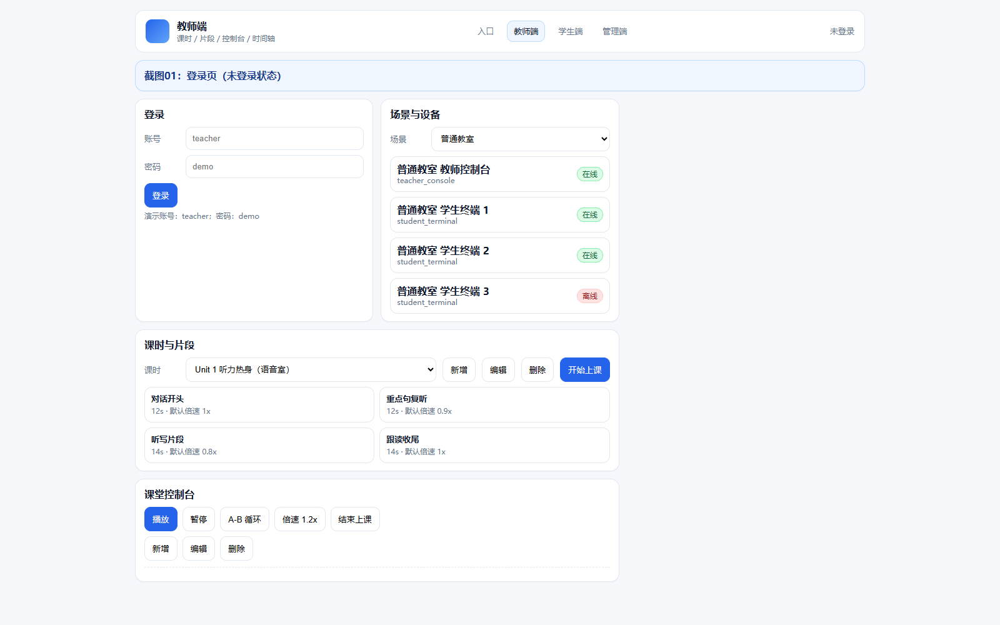
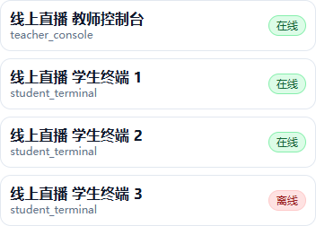
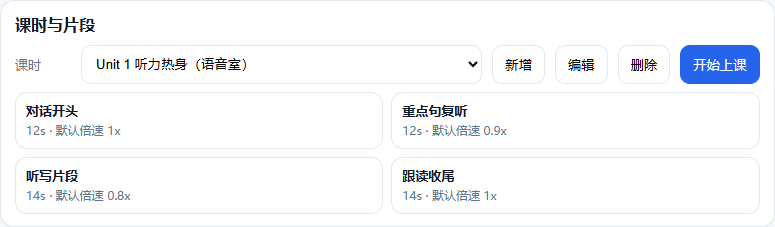
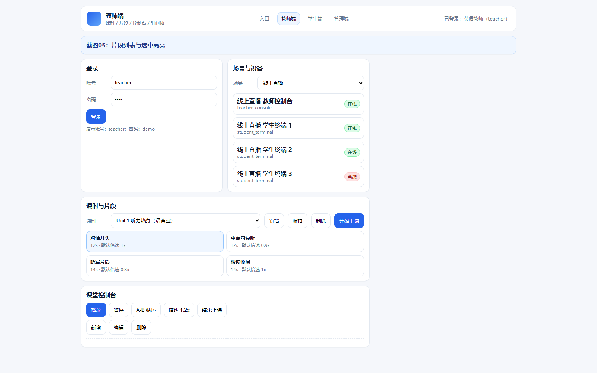
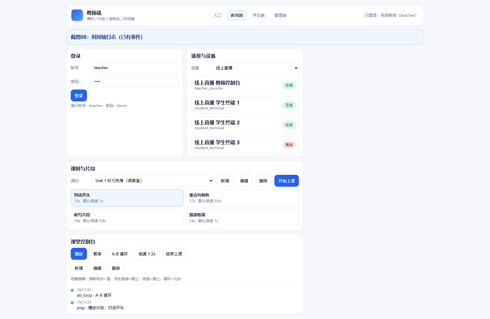
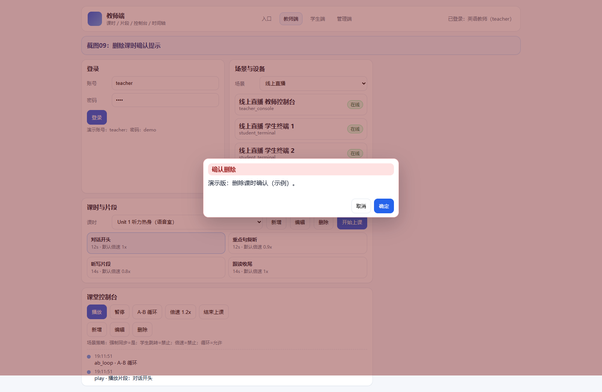
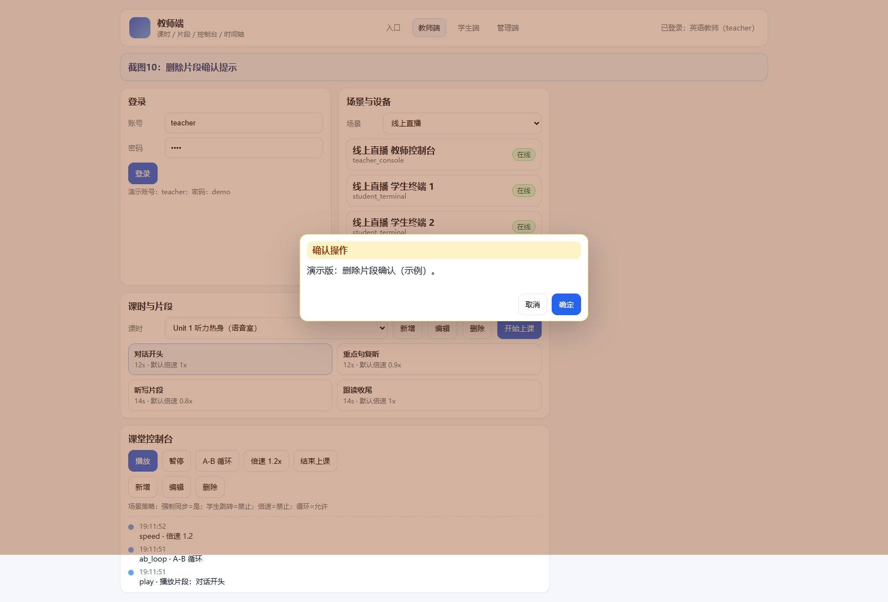
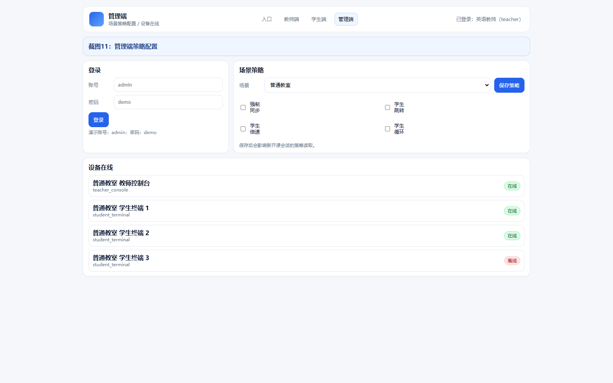
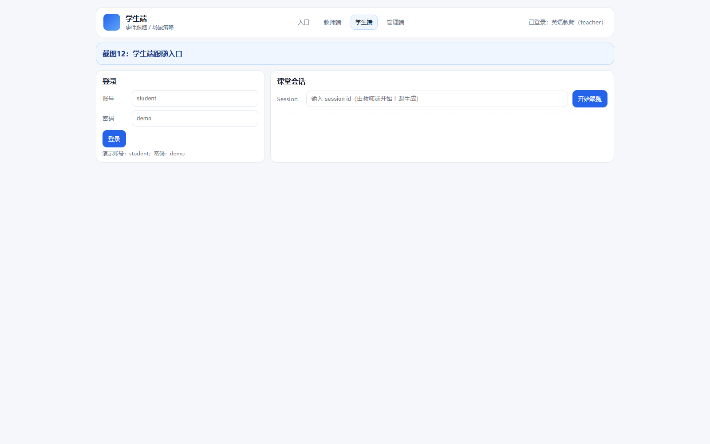

## 1 文档定位与适用对象
### 1.1 文档说明
本文档用于指导英语教师、学生与管理员在不同教学场景下使用“音频播放 + 管控 + 日志复盘”功能。文档描述以演示版实现为准，所有功能均可在系统页面与接口中定位到对应实现。

软件全称：多场景英语教学音频播放与管控软件 V1.0

### 1.2 适用对象
- 英语教师：创建课时、选择片段播放、生成课堂控制事件与日志。
- 学生：在学生端页面查看课堂播放事件，理解场景策略对跳转/倍速的限制。
- 管理员：查看场景与设备清单，掌握终端在线状态。

## 2 系统入口与登录
### 2.1 访问入口
演示版采用“前端静态页 + API 服务”方式：
- 前端：`apps/web/index.html`
- API：`/api/health`

### 2.2 登录
1) 打开首页，输入账号与密码。  
2) 点击“登录”，右上角显示当前登录用户与角色。  
演示账号：`teacher` / `student` / `admin`，密码均为 `demo`。

代码定位证据：`apps/api/routers/auth.py` `POST /api/login` `authenticate_user`

## 3 场景与设备
### 3.1 场景策略说明
系统内置 5 类场景，并为每类场景配置能力开关：
- 强制同步（force_sync）
- 学生跳转（student_seek）
- 学生倍速（student_speed）
- 学生循环（student_loop）

代码定位证据：`packages/core/store.py` `_seed` `scene_language_lab`

#### 3.1.1 场景策略对课堂节奏的影响
本系统把“是否允许学生端自由操作”的规则显式化，避免课堂临时口头约束带来的执行偏差。教师在开始上课后会看到当前会话绑定的场景策略，学生端（演示）在拉取事件时以该策略作为权限依据。

策略字段口径：
- `force_sync`：为 `true` 时，课堂以教师端为准，学生端不提供自由跳转入口（演示版通过“仅展示策略 + 事件跟随”体现）。
- `student_seek`：为 `true` 时，学生端允许在回听场景下按片段跳转（演示版用策略说明与后续扩展点体现）。
- `student_speed`：为 `true` 时，学生端允许切换倍速（演示版用策略说明与后续扩展点体现）。
- `student_loop`：为 `true` 时，允许片段循环训练（演示版通过教师端 `ab_loop` 事件体现循环训练意图）。

场景建议用法（演示口径）：
- 语音室：`force_sync=true`，教师主导，适合听写与跟读节奏统一。
- 线上直播：`force_sync=true`，避免网络延迟下的学生端随机跳转。
- 自习室：允许跳转/倍速/循环，适合学生自主回听训练。

### 3.2 设备列表
选择场景后，页面展示该场景下的教师控制台与学生终端，并显示在线/离线状态。

代码定位证据：`apps/api/routers/devices.py` `GET /api/devices` `list_devices`

#### 3.2.1 设备字段口径
设备面板用于让教师或管理员快速判断“当前教学场景是否具备开课条件”。演示版设备字段如下：
- 名称：用于区分教师控制台与学生终端。
- 类型：`teacher_console` / `student_terminal`。
- 在线状态：`online=true` 表示该终端可接受课堂控制事件（演示版以固定数据模拟）。
- 末次心跳：用于追溯离线原因（演示版以时间戳模拟）。

## 4 课前准备（教师）
课前准备建议在上课前完成，减少课堂中切换页面与搜索资源的时间。
1) 选择目标场景（例如语音室/线上直播）。  
2) 登录教师账号，确认右上角显示为教师角色。  
3) 在“课时与片段”区域确认本节课的课时是否存在：没有则点击“新增”。  
4) 在片段列表中选择预期使用的片段，检查片段标签与默认倍速是否符合课堂计划。  
5) 若本节课需要重复训练某句，可在课堂中使用 “A-B 循环” 控制事件。  

代码定位证据：`apps/web/teacher.js` `refreshLessons` `refreshClips`

## 8 管理员使用（演示）
管理员侧关注“场景策略是否符合教学管理要求、终端是否在线、异常是否可追溯”。演示版把管理员能力集中在数据可见性与入口位置确认。

### 8.1 场景能力核对
管理员可切换不同场景，查看策略字段并确认是否满足教务要求。例如：
- 线上直播：建议禁止学生端跳转与倍速，避免课堂内容不同步。
- 口语角：允许学生端倍速与循环，强调自主练习与跟读节奏调整。

代码定位证据：`packages/core/store.py` `capabilities` `scene_live`

### 8.2 设备在线核对
进入设备面板后，管理员可观察：
- 同一场景下学生终端是否有离线；离线可能来自网络或终端未启动（演示版为模拟状态）。
- 教师控制台是否在线；若教师控制台离线，应先恢复环境再开课。

代码定位证据：`apps/api/routers/devices.py` `list_devices` `scene_id`

## 9 数据字典（演示口径）
本节用于说明页面与接口里常见字段的含义，便于材料审核与二次扩展时保持一致。

### 9.1 课时（Lesson）
- `id`：课时标识（系统生成）。
- `title`：课时名称，出现在课时下拉框。
- `scene_id`：场景标识，与策略绑定。
- `teacher_id`：授课教师标识（演示版为固定用户）。
- `status`：`draft` / `running`（演示版用于表示是否已开始上课）。

代码定位证据：`packages/core/store.py` `create_lesson` `status`

### 9.2 片段（Clip）
- `label`：片段标签，用于课堂中快速定位。
- `start_ms` / `end_ms`：片段起止时间（毫秒）。
- `default_speed`：默认倍速建议。
- `loop_suggest`：建议循环次数（用于课堂训练节奏提示）。

代码定位证据：`packages/core/store.py` `create_clip` `start_ms`

### 9.3 会话与事件
- `PlaybackSession`：一次课堂开始到结束的会话容器（演示版创建后不做结束逻辑）。
- `ControlEvent`：课堂操作留痕记录，可按 `since` 增量读取。

代码定位证据：`apps/api/routers/control.py` `list_events` `since`

## 10 接口清单（演示）
本系统接口以 `/api` 为前缀，常用接口如下：
- `POST /api/login`：登录
- `GET /api/scenes`：场景列表
- `GET /api/devices`：设备列表（可按 `scene_id` 过滤）
- `GET /api/lessons`：课时列表
- `POST /api/lessons`：新增课时
- `GET /api/lessons/{lesson_id}/clips`：片段列表
- `POST /api/lessons/{lesson_id}/clips`：新增片段（演示版保留接口，前端入口为按钮提示）
- `POST /api/lessons/{lesson_id}/start`：开始上课（创建 session）
- `POST /api/sessions/{session_id}/event`：提交控制事件
- `GET /api/sessions/{session_id}/events`：拉取事件列表
- `GET /api/sessions/{session_id}/policy`：读取会话策略
- `GET /api/lessons/{lesson_id}/stats`：统计

代码定位证据：`apps/api/routers/control.py` `get_policy` `/api/sessions/{session_id}/policy`

## 5 课时与片段
### 4.1 新建课时
1) 用 `teacher` 登录。  
2) 在“课时与片段”区域点击“新增”。  
3) 课时会绑定当前选择的场景，用于决定学生端权限。

代码定位证据：`apps/api/routers/lessons.py` `POST /api/lessons` `create_lesson`

### 4.2 编辑与删除（演示入口）
在课时下拉框右侧提供“编辑”“删除”按钮，用于演示课时维护入口与管控面板的基本交互位置。

代码定位证据：`apps/web/index.html` `btnEditLesson` `btnDeleteLesson`

### 4.2 片段列表
选择课时后显示片段列表。片段包含标签、起止时间、默认倍速等信息。点击片段会高亮为“当前片段”。

代码定位证据：`apps/api/routers/lessons.py` `GET /api/lessons/{lesson_id}/clips` `list_clips`

### 4.3 片段维护（演示入口）
控制台在播放按钮下方提供片段“新增 / 编辑 / 删除”入口，用于演示资源维护操作位置。

代码定位证据：`apps/web/index.html` `btnAddClip` `btnDeleteClip`

### 4.4 课时与片段的命名建议（便于课堂操作）
为减少课堂中反复查找，建议按“单元 + 训练目的”命名课时，并按“训练动作 + 语料位置”命名片段：
- 课时示例：`Unit 2 听写训练`、`Unit 5 跟读热身`、`Unit 3 重点句复听`。
- 片段示例：`对话开头`、`重点句复听`、`听写片段`、`跟读收尾`。

演示版虽不强制命名规则，但手册建议的命名方式与 UI 结构一致，便于后续扩展为校验规则或模板。

## 6 课堂控制台与日志
### 5.1 开始上课
教师选择课时后点击“开始上课”，系统创建播放会话（session），并在页面显示该会话对应的场景策略。

代码定位证据：`apps/api/routers/control.py` `POST /api/lessons/{lesson_id}/start` `start_lesson`

### 5.2 播放/暂停/循环/倍速
1) 先选择一个片段。  
2) 点击“播放”产生 `play` 事件；点击“暂停”产生 `pause` 事件。  
3) 点击 “A-B 循环”产生 `ab_loop` 事件；点击“倍速 1.2x”产生 `speed` 事件。  
4) 所有控制事件进入时间轴日志，便于课后复盘。

代码定位证据：`apps/api/routers/control.py` `POST /api/sessions/{session_id}/event` `add_event`

#### 5.2.1 控制事件字段口径
课堂控制台的每次操作都会形成一条控制事件，用于复盘：
- `seq`：事件序号，学生端按 `since` 增量拉取。
- `action`：事件类型（`play` / `pause` / `ab_loop` / `speed`）。
- `payload`：与事件相关的参数（例如片段 id、倍速值）。
- `created_at`：事件时间戳，用于时间轴展示。

代码定位证据：`packages/core/store.py` `add_event` `seq`

#### 5.2.2 时间轴阅读方法
时间轴按“最新事件在上方”展示，便于教师在课堂中快速确认刚刚发出的指令是否已落入系统日志。课后复盘时，可按事件类型统计出课堂中重复训练的片段与常用操作（演示版提供统计接口入口，便于扩展为图表）。

代码定位证据：`apps/api/routers/stats.py` `GET /api/lessons/{lesson_id}/stats` `lesson_stats`

### 5.3 结束上课（演示）
课堂结束时，建议点击“结束上课”，用于标记本次会话结束时间，避免后续事件继续写入同一会话（演示版提供会话结束接口与状态标记）。

代码定位证据：`apps/api/routers/control.py` `POST /api/sessions/{session_id}/end` `end_session`

## 7 学生端（事件跟随演示）
演示版学生端不做真实音频同步播放，使用“事件轮询”模拟跟随：学生端按 `since` 序号拉取新事件，并依据场景策略决定是否允许跳转/倍速等操作。

代码定位证据：`apps/api/routers/control.py` `GET /api/sessions/{session_id}/events` `since`

### 6.1 事件跟随的操作说明（演示）
1) 教师开始上课后，系统创建 session。  
2) 教师在控制台点击播放，产生 `play` 事件。  
3) 学生端通过轮询接口拿到新事件后，根据策略提示“本场景是否允许自由操作”。  
4) 演示版把“跟随”体现为：学生端页面持续更新事件列表，并把当前策略展示给用户。  

### 6.2 课堂复盘建议（演示口径）
课后复盘时可以关注：
- 哪些片段播放次数高：可能是难点句或课堂节奏需要调整。
- `ab_loop` 使用频率：可以衡量重复训练强度。
- `pause` 频率：可用于回看讲解与播放切换的节奏。

代码定位证据：`packages/core/store.py` `lesson_stats` `action_count`

### 7.3 学生端行为口径（用于材料一致性）
为避免“手册描述超出实现范围”，本项目对学生端能力做如下口径约束（演示版以可见性与策略提示为主）：
- 学生端不直接播放音频文件：页面展示“当前课堂事件”与“场景策略”，用于说明课堂管控模型。
- 学生端不提供倍速/跳转按钮：是否允许倍速/跳转以策略提示呈现，便于后续扩展为真实播放控件。
- 学生端事件列表按 `since` 增量拉取：保证数据量可控，并可用作“课堂复盘”统计的输入。

代码定位证据：`apps/web/student.js` `poll` `/api/sessions/{session_id}/events`

### 7.4 复盘建议（面向教师与管理员）
当课堂结束后，建议从以下角度复盘：
1) 高频播放片段：可能是难点句或听写片段，需要在后续课时中提前预热。  
2) `ab_loop` 使用次数：可衡量重复训练强度；若过高，建议把片段拆分更细或调整倍速策略。  
3) `pause` 分布：暂停密集通常意味着讲解插入较多，可考虑把讲解拆成“先讲后听”或“先听后讲”的固定节奏。  
4) 场景策略适配：若在自习室也出现大量重复训练，建议为该场景提供更自由的回听与倍速（正式版可落地到学生端控件）。  

## 11 交互安全提示（演示说明）
### 8.1 删除课时确认
点击“删除”按钮后，演示版会弹出确认类提示，用于展示“误操作防护”的交互位置（正式版可扩展为二次确认对话框与权限校验）。

代码定位证据：`apps/web/app.js` `btnDeleteLesson` `alert`

### 8.2 删除片段确认
点击片段区域的“删除”入口后，演示版同样会弹出确认类提示，用于展示片段维护操作的安全提示位（正式版可扩展为确认弹窗与回滚机制）。

代码定位证据：`apps/web/app.js` `btnDeleteClip` `alert`

## 12 管理端策略配置（演示）
管理端用于配置不同教学场景的策略开关，并查看终端在线情况。

代码定位证据：`apps/api/routers/scenes.py` `PATCH /api/scenes/{scene_id}` `update_scene_capabilities`

## 13 学生端跟随（演示）
学生端输入教师端创建的 `session id` 后开始轮询事件列表，用于展示“按场景策略跟随”的效果。

代码定位证据：`apps/web/student.js` `follow` `/api/sessions/{session_id}/events`

## 14 常见问题
1) 页面初始化失败  
- 检查 API 是否启动并可访问 `/api/health`。  

2) 无法创建课时/开始上课  
- 需使用 `teacher` 账号登录。  

3) 时间轴无事件  
- 需先开始上课，再选择片段触发播放事件。  

4) 截图看起来“没有更新”  
- 截图生成与验收的通用规则见公共运维文档：`E:\\copyRight\\workspace\\Runbook_Screenshots_and_PDF.md`。  
