## 1. 文档定位与适用对象

### 1.1 文档说明

本手册用于指导用户在“结构抗震韧性评估专用知识库与数据治理平台软件”中完成从数据治理到评估沉淀的完整闭环操作。系统重点强调三件事：

1) 数据版本与质量证据：每一次数据变更都要能说明“变更了什么、为什么变更、对结论有什么影响”。  
2) 评估链路可追溯：评估记录必须能追溯到数据集版本与质量检查结果。  
3) 复核与审计留痕：关键操作（新增、编辑、删除、质量检查执行、评估提交、复核）都需要有审计记录，便于复核与问责。  

说明：本版本不包含大型有限元求解与外部监测系统接入；指标计算以“配置化字段绑定 + 示例规则/人工录入”为主，目标是把评估证据链与数据治理口径落到可运行系统中。

### 1.2 适用对象

| 角色 | 日常工作 | 在系统中的主要动作 |
|---|---|---|
| 管理员 | 管理系统与账号 | 登录、查看审计、全模块操作（演示） |
| 评估工程师 | 建模与评估结论形成 | 维护项目/结构对象、配置指标、提交评估、沉淀知识条目 |
| 数据治理专员 | 数据台账与质量控制 | 登记数据集、维护版本、配置质量规则、执行质量检查 |
| 复核人员 | 复核与抽检 | 查看证据链、复核评估记录、查看审计留痕 |

### 1.3 权限与操作口径（RBAC）

系统采用“角色 + 权限点”的控制方式。演示环境建议使用管理员账号完成全流程，以便截图覆盖全部模块。

权限口径说明：
- `projects:*`：项目台账的新增/编辑/删除  
- `structures:*`：结构对象的新增/编辑/删除  
- `datasets:*`：数据集治理（登记/版本）  
- `quality:*`：质量规则与质量检查执行  
- `indicators:*`：指标配置  
- `assessments:*`：评估记录提交与复核  
- `knowledge:*`：知识条目维护  
- `audit:*`：审计日志查询与导出  

## 2. 系统入口与登录

### 2.1 访问入口

系统启动后，通过浏览器打开系统首页即可进入登录界面。登录成功后进入主界面（左侧导航 + 右侧业务区域）。

图示：图1-1

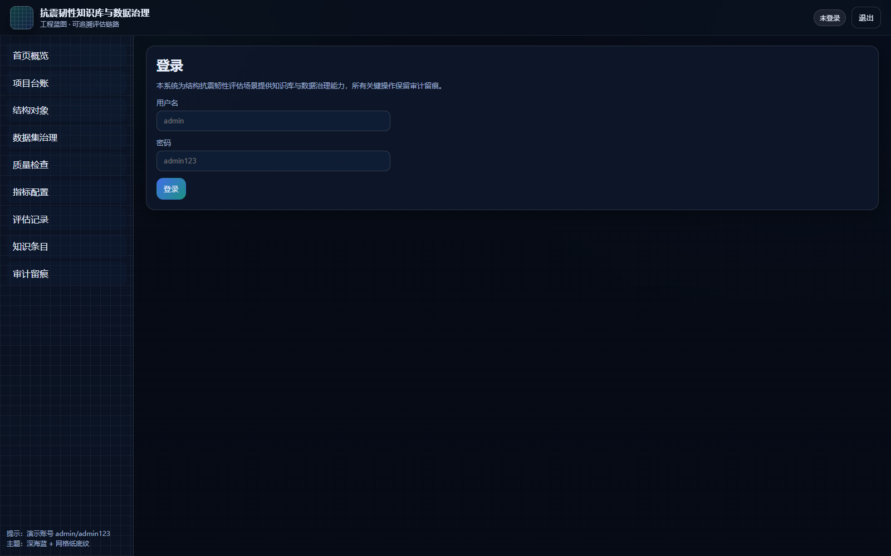

### 2.2 登录步骤

1. 在“用户名”输入框中输入账号，例如：`admin`。  
2. 在“密码”输入框中输入密码，例如：`admin123`。  
3. 点击“登录”。  
4. 登录成功后，右上角角色信息会显示当前用户与角色。  

图示：图1-1

### 2.3 退出登录

1. 点击右上角“退出”。  
2. 系统返回登录界面。  

## 3. 首页概览与导航逻辑

### 3.1 首页展示内容

首页用于快速了解数据与流程的总体状态，包含：
- 项目数量、结构对象数量、数据集数量、审计记录数量等概览卡片；  
- 项目列表（工程台账风格），可点击“查看”打开详情弹窗；  
- 强调“数据—质量—指标—评估”的链路意识：任何结论都应该能回到证据。  

图示：图2-1

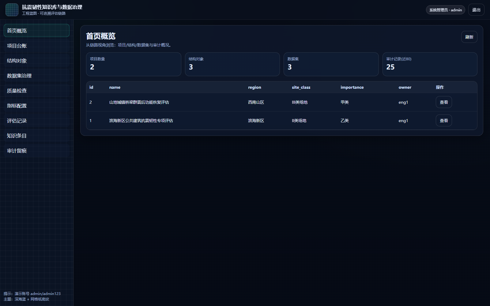

### 3.2 左侧导航与页面切换

系统使用左侧导航切换模块。每个模块的右上角包含：
- “刷新”：重新拉取数据；  
- “新增”：在支持新增的模块中打开新增弹窗；  
- 某些只读模块（例如审计留痕）可能隐藏“新增”。  

## 4. 项目台账

### 4.1 模块目的

项目台账是评估工作的顶层容器，用于承载结构对象与评估记录。建议在项目名称中体现区域、对象类型与任务背景，便于后续检索与交付归档。

图示：图3-1

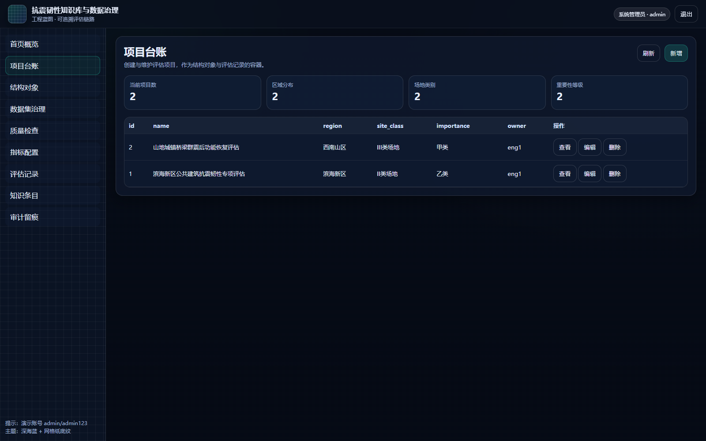

### 4.2 新增项目（弹窗）

1. 进入“项目台账”。  
2. 点击右上角“新增”。  
3. 在弹窗中填写项目名称、区域、场地类别、重要性等级。  
4. 点击“提交”完成新增。  
5. 新增成功后刷新列表，项目会出现在列表顶部。  

图示：图3-2  

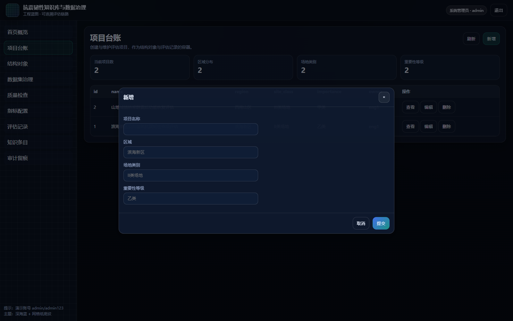

说明：新增动作属于关键操作，会写入审计日志，便于追溯“是谁在什么时间创建了项目”。

### 4.3 编辑项目（弹窗）

1. 在项目列表行内找到目标项目。  
2. 点击“编辑”。  
3. 在弹窗中修改字段，点击“提交”。  
4. 修改成功后刷新列表，检查字段是否更新。  

图示：图3-2a  

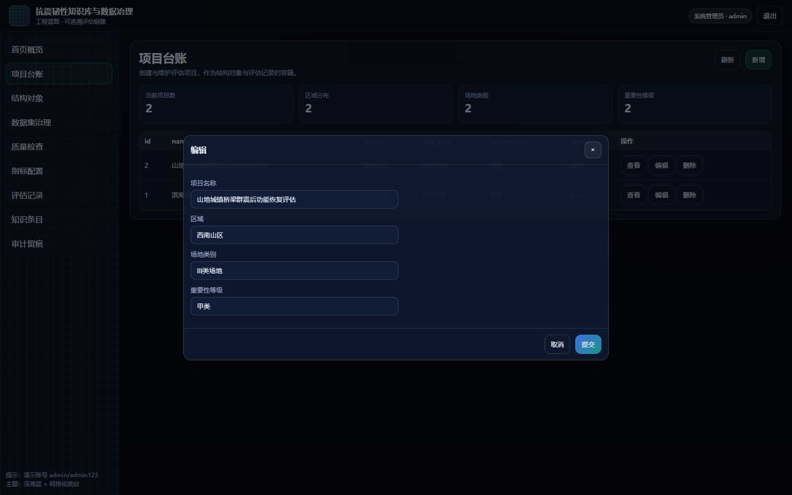

建议：编辑前先明确变更原因（例如“场地类别口径纠正”），并在团队流程中保留变更说明；本版本审计日志会记录动作与对象，便于后续人工补充说明。

### 4.4 删除项目（确认弹窗）

删除会影响后续结构对象与评估记录，需谨慎操作。

1. 在项目列表行内点击“删除”。  
2. 系统弹出删除确认对话框。  
3. 确认无误后点击确认按钮完成删除。  
4. 删除成功后，项目从列表中移除。  

图示：图3-2b  

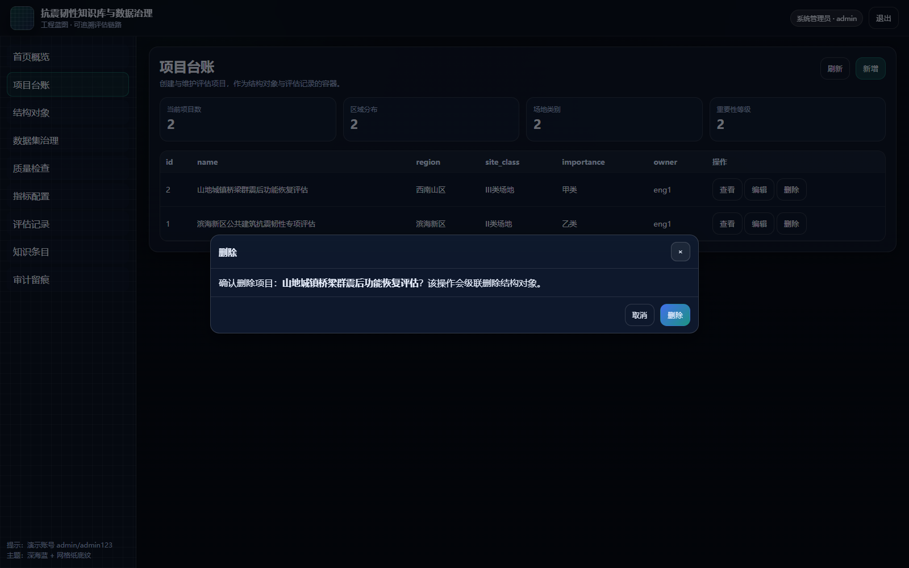

注意：删除为关键操作，会写入审计日志。若项目下已存在结构对象，本版本会执行级联删除（用于演示闭环，不建议在真实生产环境无差别级联）。

## 5. 结构对象

### 5.1 模块目的

结构对象是评估工作的“主键对象”。指标、评估记录、知识条目都应围绕结构对象沉淀。结构对象字段建议保持工程口径一致，例如结构体系、建成年代、设防烈度等。

图示：图3-3

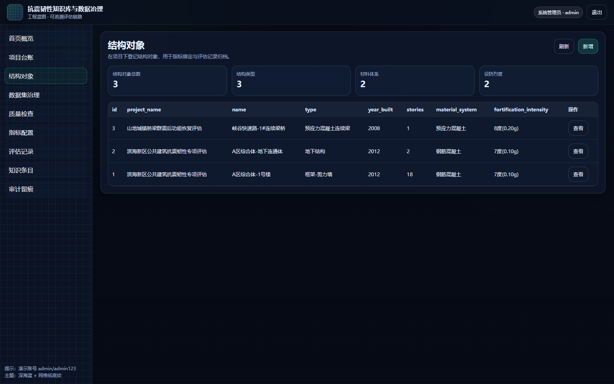

### 5.2 查看结构对象（查看弹窗）

1. 进入“结构对象”模块。  
2. 在列表中选择一条结构对象记录。  
3. 点击“查看”打开详情弹窗。  
4. 在弹窗中核对字段，例如结构类型、层数、材料体系、设防烈度等。  
5. 点击弹窗右上角关闭按钮返回列表。  

图示：图3-4  

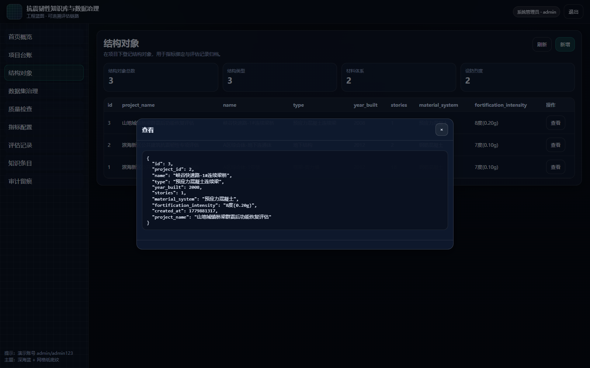

说明：查看弹窗主要用于复核与抽检；复核人员可通过查看字段确认建模口径是否一致。

### 5.3 新增结构对象（弹窗）

1. 点击右上角“新增”。  
2. 在弹窗中填写项目ID、结构名称、结构类型、建成年代、层数、材料体系、设防烈度。  
3. 点击“提交”完成新增。  
4. 刷新列表确认新增成功。  

补充建议：
- 结构名称建议包含分区/楼号/桥号等信息，便于与现场资料对照；  
- 建成年代用于后续“规范版本/材料标准”的口径判断；  
- 设防烈度与场地类别会影响指标解释与韧性结论表述。  

## 6. 数据集治理（登记/版本）

### 6.1 模块目的

数据集治理用于把“评估所用的数据”变成可管理资产。建议把数据集分为：构件台账、材料检测、监测数据、震害样本、场地条件、加固方案等类别，并为每个数据集维护来源说明与敏感级别。

图示：图3-5

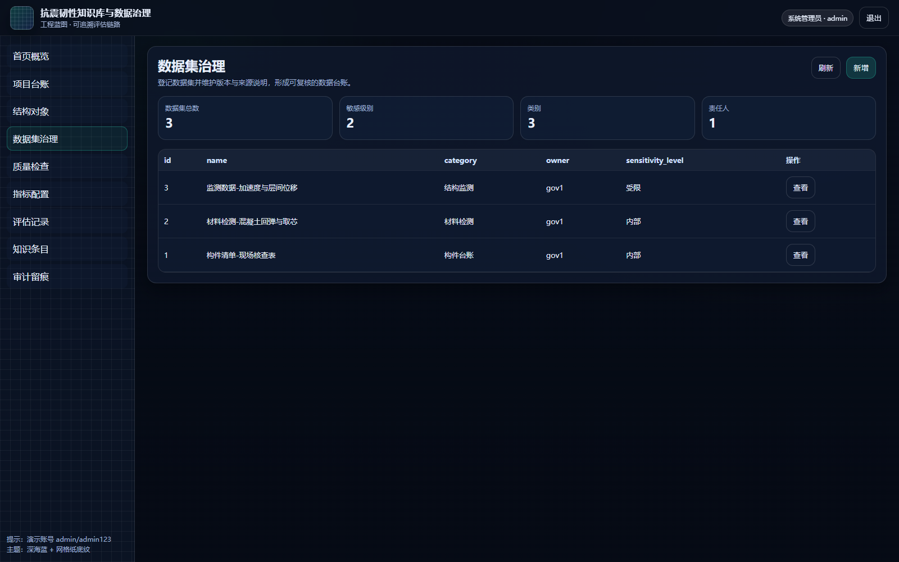

### 6.2 新增数据集（弹窗）

1. 进入“数据集治理”。  
2. 点击右上角“新增”。  
3. 在弹窗中填写数据集名称、类别、来源说明、敏感级别。  
4. 点击“提交”完成新增。  
5. 刷新列表确认新增成功。  

图示：图3-6  

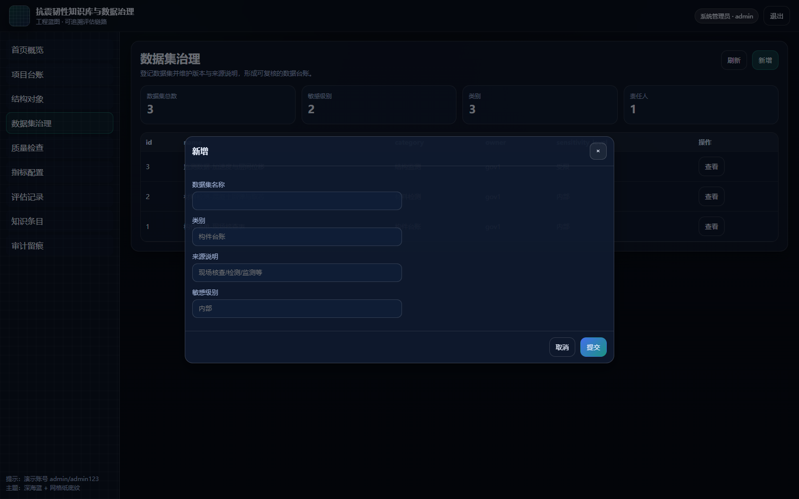

建议的来源说明写法：
- “现场核查：日期、范围、抽样策略、责任人”；  
- “第三方检测：报告编号、抽样构件与位置”；  
- “监测数据：传感器布设、采样频率、时间窗”。  

### 6.3 查看数据集与版本列表（查看弹窗）

1. 在数据集列表点击“查看”。  
2. 系统弹窗展示数据集详情与版本列表（若已创建版本）。  
3. 复核时重点关注：版本号、变更说明、创建时间。  

本版本版本管理用于演示“版本化口径”，具体的字段级对比以简化文本方式呈现。

## 7. 质量规则与质量检查

### 7.1 模块目的

质量检查用于把“数据能不能用”变成可度量证据。典型质量规则包括：
- 必填字段：关键字段不能为空；  
- 最小条目数：记录数过少无法支撑结论；  
- 枚举口径：字段值必须落在约定集合；  
- 关联一致性：主外键或引用关系必须存在。  

图示：图3-7

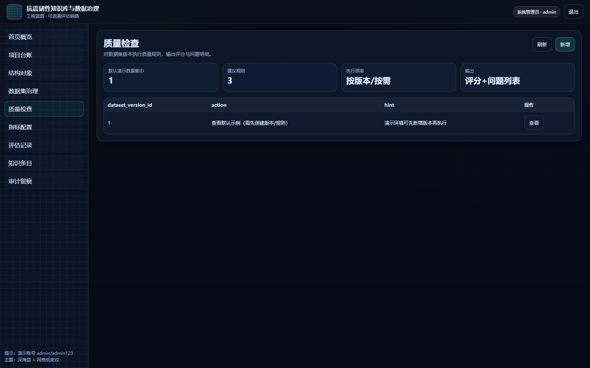

### 7.2 新增质量规则（弹窗）

1. 进入“质量检查”模块。  
2. 点击右上角“新增”。  
3. 在弹窗中填写数据集ID、规则类型、规则表达式、严重性。  
4. 点击“提交”。  

示例（口径建议）：
- `required_field`：`items` 表示 payload 中必须包含 items 字段；  
- `min_items`：`items,2` 表示 items 列表长度至少为 2；  
- `enum`：`site_class=I|II|III` 表示场地类别口径必须落在 I/II/III。  

说明：该弹窗属于关键配置动作，建议在团队内形成“口径规则清单”，并定期复核。

### 7.3 触发质量检查（查看弹窗 + 执行）

本版本提供“示例执行入口”用于展示质量检查执行与结果呈现：

1. 在质量检查页面点击“查看”。  
2. 系统弹出对话框，提示可触发一次质量检查。  
3. 点击弹窗中的“执行质量检查”。  
4. 系统返回一次执行结果（评分 + 问题列表）。  

图示：图3-8  

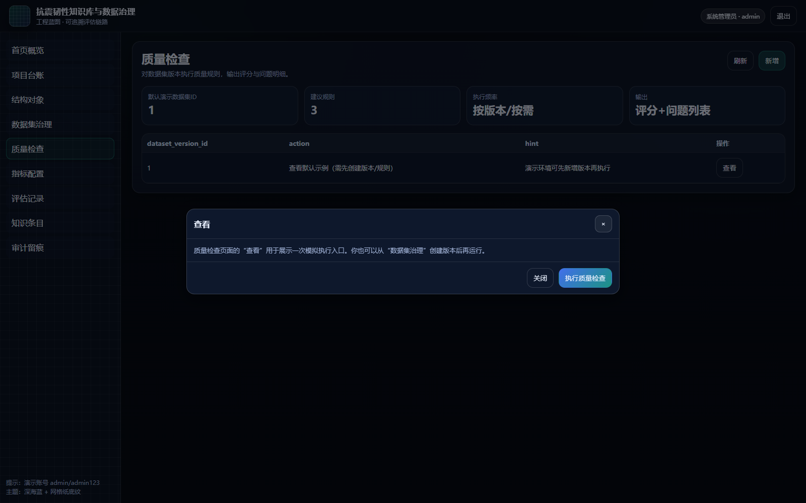

说明：质量检查结果会被用于评估链路的证据引用。若质量失败但仍需要出具阶段性结论，应在评估摘要中明确风险说明与补充计划。

## 8. 指标配置与数据绑定

### 8.1 模块目的

指标配置用于把“评估要看的指标”与“数据版本”绑定起来。指标不是孤立数字，必须能回答：
- 这个指标是基于哪份数据版本得到的？  
- 采用了什么方法（公式/脚本/人工录入）？  
- 关键假设是什么，是否被复核？  

图示：图3-9

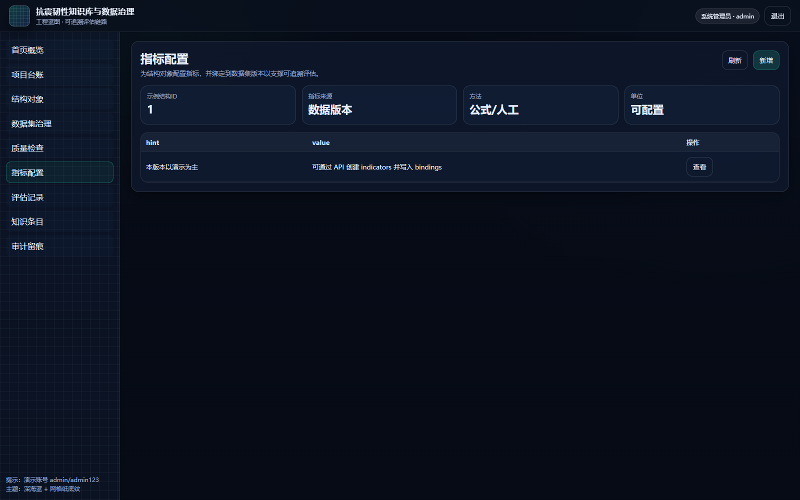

### 8.2 新增指标（弹窗）

1. 进入“指标配置”。  
2. 点击右上角“新增”。  
3. 填写结构ID、指标名称、方法、单位。  
4. 点击“提交”。  

示例指标（建议写法）：
- 指标名称：层间位移角（限值比）  
- 方法：manual_or_formula（表示可由人工或公式计算）  
- 单位：ratio  
- 绑定：dataset_version_id=1，fields=["story_drift_angle"]（示例）  

说明：本版本的绑定以示例 JSON 表达为主，目标是把“指标—数据版本”的关系固化为可追溯信息。

## 9. 评估记录与复核

### 9.1 模块目的

评估记录用于把指标与工程判断形成可交付结论。建议评估摘要包含：
- 结构对象与设防背景简述；  
- 关键指标与证据来源；  
- 风险点与建议处置（如补测、复核、加固方案比选）。  

图示：图3-10

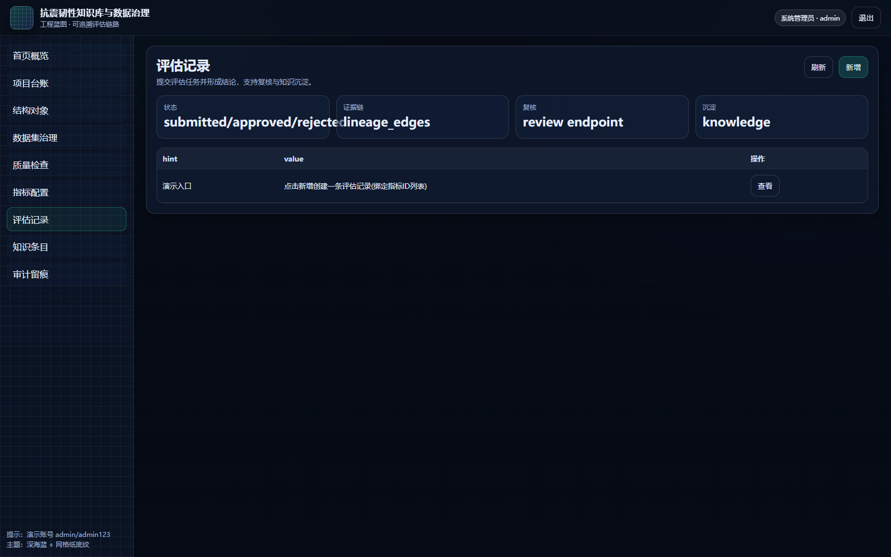

### 9.2 新增评估记录（弹窗）

1. 进入“评估记录”。  
2. 点击右上角“新增”。  
3. 填写结构ID、评估摘要、指标ID列表。  
4. 点击“提交”形成一条评估记录（状态为 submitted）。  

建议的摘要写法示例：
- “在设防地震水平下结构整体延性满足要求，但关键连梁延性指标偏弱；建议补充构造复核与局部加固比选。”  

### 9.3 复核口径（通过/驳回）

复核人员建议按以下清单抽检：
1. 数据来源：是否绑定到明确的数据版本；  
2. 质量证据：质量检查是否通过，若未通过是否在摘要中说明；  
3. 指标口径：方法与单位是否一致，是否存在混用；  
4. 结论一致性：摘要是否能被指标与证据支撑。  

说明：本版本提供复核接口与审计留痕，但前端界面以演示闭环为主；实际团队流程可在此基础上扩展复核工作流。

## 10. 知识条目沉淀与检索

### 10.1 模块目的

知识条目用于把“可复用的经验”沉淀下来。建议一个条目包含：
- 结论摘要（可复用表达）；  
- 适用条件（结构类型、区域、设防水平、数据口径）；  
- 证据引用（数据版本、质量记录、关键指标）；  
- 风险提示（不适用情况与注意事项）。  

图示：图3-11

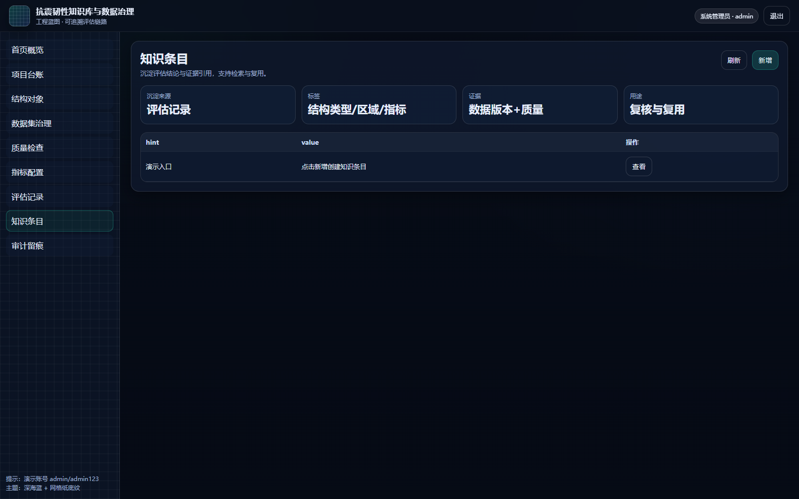

### 10.2 新增知识条目（弹窗）

1. 进入“知识条目”。  
2. 点击右上角“新增”。  
3. 填写标题、标签、摘要。  
4. 点击“提交”。  

标签建议：
- 结构体系（框剪/连续梁/地下结构等）  
- 区域与场地类别  
- 指标关键词（层间位移角/延性/恢复时间等）  

### 10.3 检索建议

检索时建议从“结构体系 + 指标关键词 + 区域”组合开始，逐步缩小范围；当条目积累较多时，可约定统一标签字典以提升命中率。

## 11. 审计留痕与导出

### 11.1 审计留痕用途

审计模块用于查看关键操作记录，例如：新增、编辑、删除、执行质量检查、提交评估、复核、登录等。审计信息通常用于：
- 复核抽检：确认关键字段是谁在何时改动；  
- 责任追踪：出现口径偏差时定位变更源头；  
- 对外交付：解释结论形成过程与证据链。  

图示：图3-12

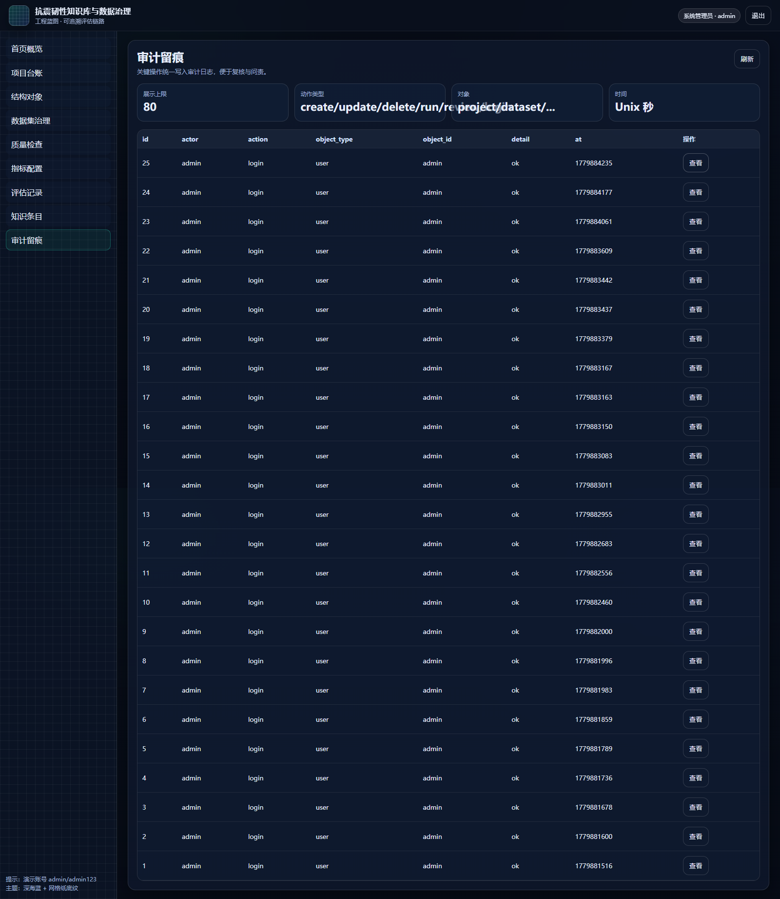

### 11.2 查看审计日志（查看弹窗）

1. 进入“审计留痕”。  
2. 在列表点击“查看”。  
3. 弹窗展示该条审计记录的完整字段。  

建议抽检字段：
- actor（操作者）  
- action（动作）  
- object_type/object_id（对象类型与ID）  
- at（时间戳）  

### 11.3 导出建议

本版本提供导出接口与示例输出。若用于项目交付，建议导出内容包括：
- 项目概览（项目字段与结构对象清单）；  
- 数据集版本与质量检查结果；  
- 评估记录与复核意见；  
- 关键审计记录摘要。  

## 12. 常见问题与排错

### 12.1 登录失败

1. 确认账号密码是否正确。  
2. 演示管理员账号为 `admin/admin123`。  
3. 若仍失败，建议查看后端服务是否启动，并检查浏览器控制台是否有网络错误。  

### 12.2 提示无权限

1. 不同角色的权限范围不同。  
2. 演示场景建议使用管理员账号操作，确保能覆盖新增、编辑、删除、查看等动作。  

### 12.3 质量检查无结果或评分为 0

1. 先确认是否已为目标数据集创建版本，并配置质量规则。  
2. 确认规则表达式是否符合约定格式。  
3. 若规则类型不支持，本版本会以“忽略/通过”的方式处理，并建议在后续版本扩展规则解释器。  

### 12.4 截图与文档不一致

1. 确认操作手册引用的图号与图片文件是否对应。  
2. 重新执行材料生成脚本以重新截图并生成 docx/pdf。  
3. 若页面结构调整（按钮文案或位置变化），需要同步更新截图计划与手册描述。  

