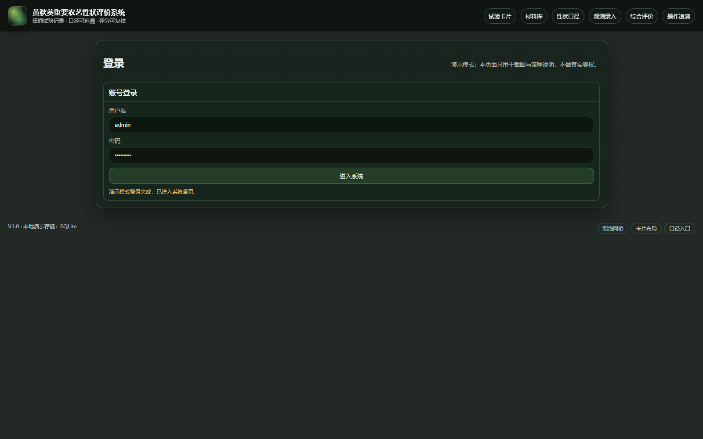
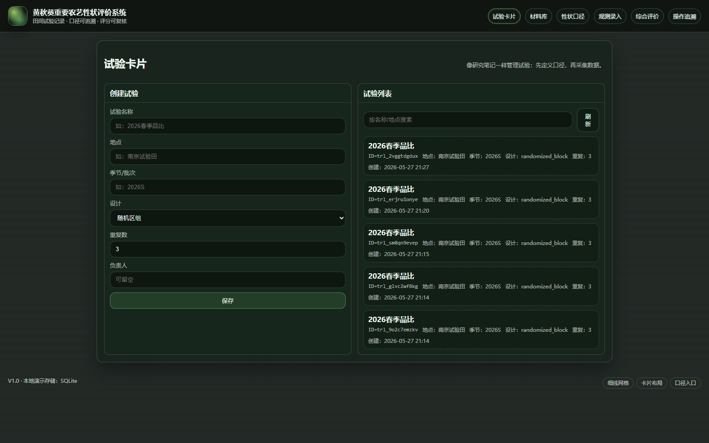
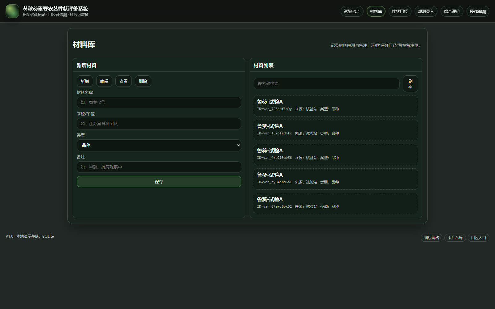
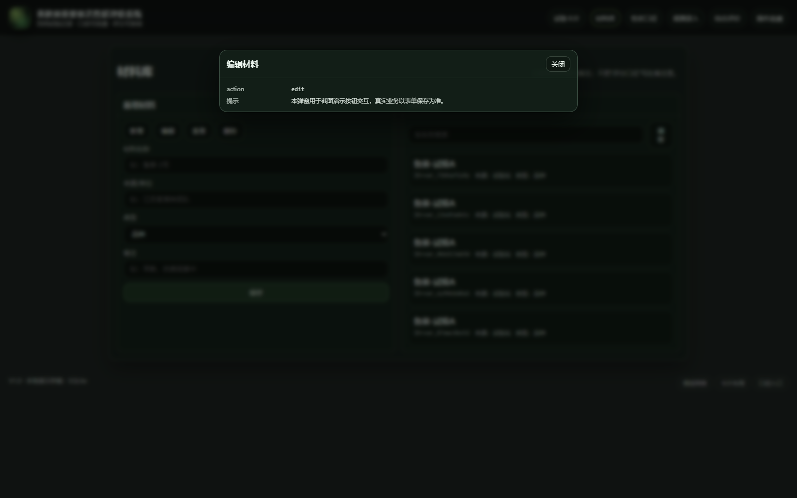
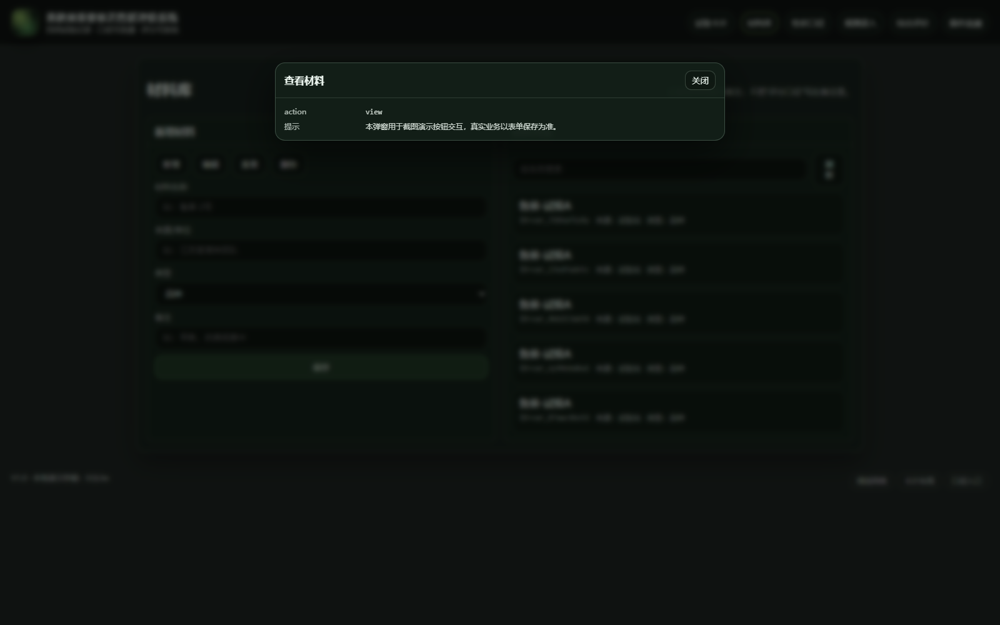
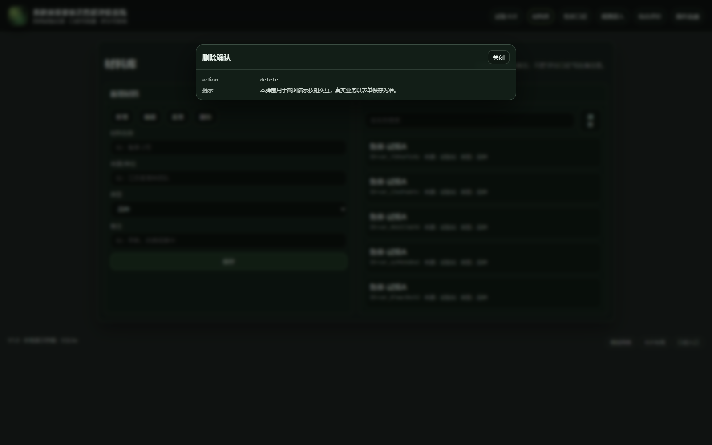
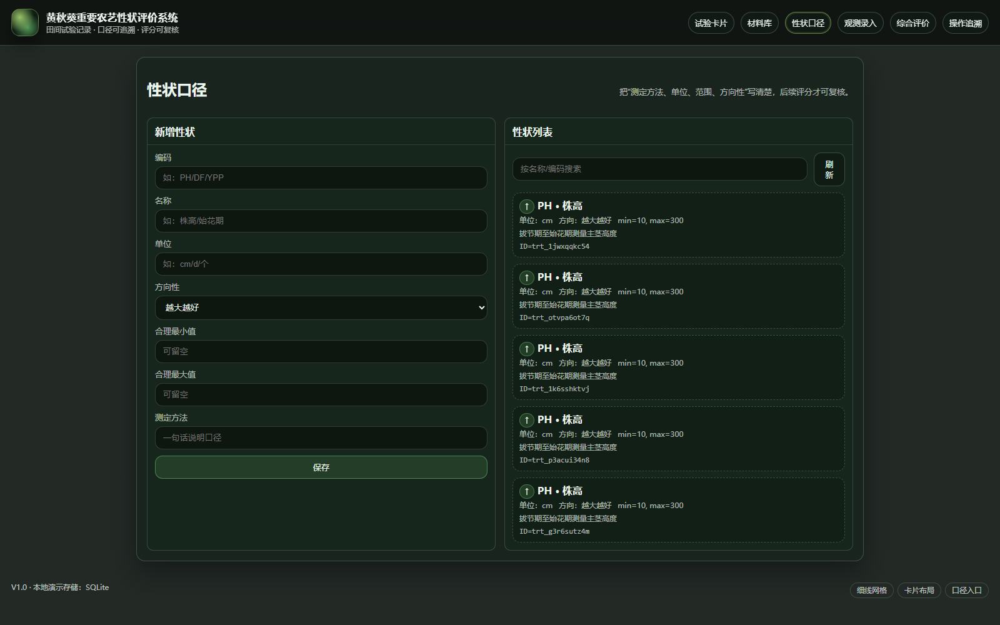
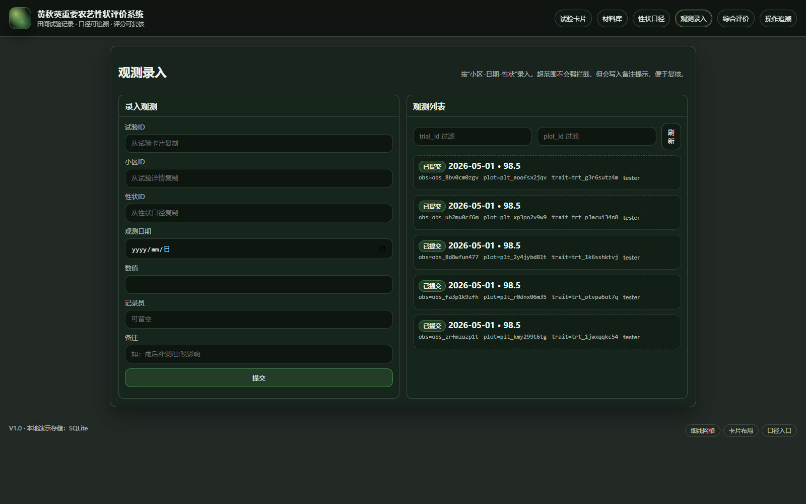
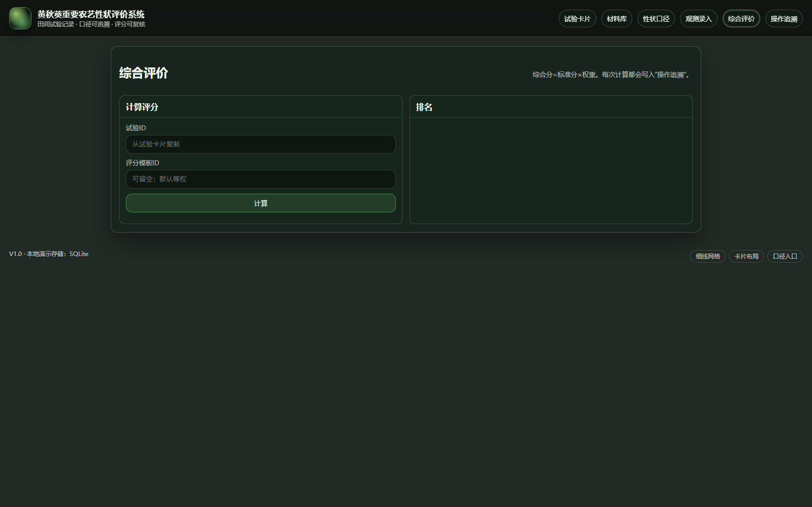
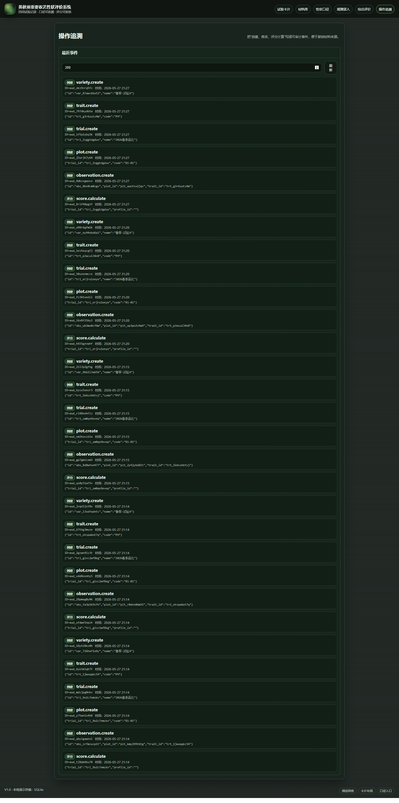

## 文档定位与适用对象
本手册用于指导试验相关人员在“黄秋葵重要农艺性状评价系统”中完成试验建档、口径维护、数据采集、质量核验与综合评价，并说明评分复核、异常留痕与导出材料的操作方法。系统强调三条工作原则：

- 口径先行：性状名称、单位、测定方法与合理范围先统一，再开展采集。
- 过程可追溯：每一条观测记录都要能追溯到小区、时间、录入人和备注。
- 结论可复核：综合评分必须能还原到“标准化方法 + 权重 + 缺失处理策略”的组合。

适用对象：
- 试验负责人：建立试验、审核数据、计算综合评分、导出结论。
- 调查员/记录员：按小区与性状填报观测值，补充现场备注。
- 数据管理员：维护材料库、性状口径库、评分模板与数据字典。
- 统计分析人员：查看得分分解，导出表格用于论文、简报与品种筛选讨论。

## 系统入口与登录
### 访问入口
1. 启动系统后，在浏览器中访问系统首页。
2. 首页包含“试验卡片、材料库、性状口径、观测录入、综合评价、操作追溯”等入口。

### 登录说明（演示模式）
当前系统以“演示模式登录页”呈现基本登录流程，用于软著截图与入口说明：
- 用户名、密码可任意填写；
- 点击“进入系统”后进入首页；
- 如需真实鉴权与账户管理，可在后续版本对接统一身份认证。

## 首页：试验卡片
首页以“试验卡片”方式管理试验。建议的工作顺序为：
1) 建立试验卡片（地点、季节、设计、重复）→ 2) 维护材料库 → 3) 维护性状口径 → 4) 建立小区布局 → 5) 观测录入与审核 → 6) 综合评价与导出。

### 创建试验
在“创建试验”卡片中填写：
- 试验名称：建议包含季节与试验目的，例如“2026春季黄秋葵品比”；
- 地点：试验站/基地名称；
- 季节/批次：例如“2026S”；
- 设计：随机区组或自定义布局；
- 重复数：通常 2~4；
- 负责人：便于追溯。

点击“保存”后，系统生成试验记录并在列表展示试验 ID。该 ID 会用于后续的小区、观测与评分计算。

### 查看试验列表与检索
在“试验列表”中可以按名称或地点搜索并刷新。建议在试验开始前，确认试验名称、地点与季节字段已固定，避免后续导出材料出现口径不一致。

### 小区布局与编码建议
当前版本通过 API 添加小区（plot），编码建议采用“区组号-序号”的方式，例如：
- B1-01 表示第 1 区组第 1 小区；
- B2-15 表示第 2 区组第 15 小区。

实践建议：
- 试验负责人先根据田间布局表确定小区编码；
- 确保同一试验内小区编码不重复；
- 小区面积字段用于后续产量折算扩展，可先按统一面积填写。

## 材料库
材料库用于维护参试品种（或材料）档案，包括来源、类型与备注。材料库的字段含义建议如下：
- 材料名称：用于排名展示与导出表格；
- 来源/单位：用于论文或简报溯源；
- 类型：品种/杂交组合/系谱材料；
- 备注：只记录材料特征与试验备注，不写评分口径。

### 新增材料
在“新增材料”表单中填写材料名称等信息，点击“保存”完成新增。建议一次性录入本次参试材料清单，避免观测录入阶段频繁补录。

### 编辑材料
当需要修订来源、类型或备注时，执行编辑操作。为了保证结论可追溯，建议：
- 重要字段变更（材料名称、来源）在备注中补充变更原因；
- 已用于试验布局的小区引用不应随意更换材料。

### 查看与删除
查看用于核对材料信息；删除用于清理误录条目。删除前建议确认：
- 该材料尚未被试验小区引用；
- 该材料没有观测记录，否则会影响评分复核。

## 性状口径
性状口径用于统一“单位、合理范围、方向性、测定方法”。系统在录入观测值时会依据合理范围给出提示，便于后续复核异常值。

### 性状字段解释
- 编码：建议短码，例如 PH（株高）、DF（始花期）、YPP（单株结荚数）；
- 名称：用于导出与排名分解展示；
- 单位：cm、d、个、%、g 等；
- 方向性：
  - 越大越好：例如产量、单株结荚数、商品荚比例；
  - 越小越好：例如始花期（越早越好）、病害等级（越低越好）；
  - 目标区间最佳：适用于某些“最佳范围”性状（扩展项）；
- 合理范围：用于“范围提示”，不作为硬性拦截；
- 测定方法：建议写清“采样对象、采样时间、计算口径”，避免同一性状在不同调查员之间出现口径漂移。

### 推荐的黄秋葵性状集合（示例）
为便于形成“产量-品质-抗性-熟性”四类指标的完整画像，建议至少包含：
- 株高（PH）、始花期（DF）；
- 单株结荚数（YPP）、单荚鲜重（FPW）、商品荚比例（CPR）；
- 主要病害等级（DIS）或虫害发生指数（扩展项）；
- 产量折算（kg/亩，扩展项）。

## 观测录入
观测以“小区-日期-性状”为单位录入。当前版本支持按试验/小区过滤查看历史观测记录。若观测值超出性状合理范围，系统会在备注中追加范围提示，不会强制阻断，便于现场记录后再复核。

### 操作流程示例：从零到得到一份可复核排名
以下示例用于说明“最小可用闭环”的操作顺序（字段值仅为示例）：
1. 创建试验：名称填写“2026春季黄秋葵品比”，地点“南京试验田”，季节“2026S”，重复数 3。保存后记录 `trial_id`。
2. 录入材料：在材料库新增 3~5 个材料，例如“鲁葵-01号、鲁葵-02号、鲁葵-03号”，并补充来源与备注。
3. 录入性状：在性状口径新增 PH（株高，cm，越大越好，范围 20~250）、DF（始花期，d，越小越好，范围 25~80）、YPP（单株结荚数，个，越大越好，范围 5~120）等。
4. 建立小区：为每个区组添加小区，编码可用 B1-01、B1-02…；确保每个小区的 `variety_id` 与材料对应正确。完成后记录需要录入的小区 `plot_id`。
5. 录入观测：进入观测录入，按“plot_id + trait_id + observed_at + value”提交。建议每个材料至少录入 2 个区组、每个性状至少 1~2 次观测，以便评分稳定。
6. 计算评分：进入综合评价，填写 `trial_id` 并点击计算；如需固定口径，可先创建评分模板并填写 `profile_id` 复算。
7. 复核与留档：查看每个材料的得分分解（trait_scores）与 explain 摘要，确认缺失处理与异常提示符合预期；最后截图并导出材料。

### 录入前检查清单
建议调查员在开始录入前确认：
- 试验 ID 正确；
- 小区 ID 对应正确的小区编码；
- 性状 ID 已与“编码/名称/单位”核对一致；
- 观测日期使用现场真实日期；
- 备注用于记录“天气、病虫害、缺苗补苗、雨后补测”等影响因素。

### 范围提示与异常值处理建议
当系统在备注中追加“范围提示”时，建议采取以下处理方式：
- 若现场测量确实异常：保留记录，并在备注说明异常原因；
- 若录入错误：补录一条正确数据，并将原数据状态改为退回/作废（扩展项）；
- 若口径范围设置不合理：由数据管理员修订性状合理范围，并记录口径变更说明。

### 审核与状态流转口径
系统支持观测状态流转（草稿/已提交/已批准/已退回）。建议口径：
- 调查员提交后不再修改原值，避免“口头更正”导致无法追溯；
- 试验负责人在质量核验后批准关键观测；
- 需要修订的记录退回并要求补充备注说明。

## 综合评价
综合评价页面用于计算材料排名。综合分来自“标准分×权重”的汇总；若未指定评分模板，则默认对当前启用性状等权处理。

### 标准化与权重说明
系统提供两类常用标准化方式：
- Min-Max：将同一性状在各材料间映射到 0~100；
- Z-Score：按均值与标准差折算到 0~100 附近（扩展时可启用）。

权重口径：
- 若未指定评分模板，系统对当前启用性状等权；
- 若指定评分模板，系统按模板归一化权重，并在结果解释中保留缺失处理摘要。

### 缺失值处理建议
在田间试验中，缺失值常见原因包括缺苗、极端天气导致未采到样等。建议策略：
- 少量缺失：不计入该性状（ignore），但在 explain 中保留提示；
- 关键性状缺失：按最低分处理（lowest），避免因缺失“虚高”；
- 生产环境可引入“区组均值/全试验均值”的插补策略（扩展项）。

### 结果解读与复核步骤
建议试验负责人在使用排名结论前按以下步骤复核：
1. 核对评分模板 ID（或确认等权口径）；
2. 抽查 2~3 个材料的性状分解是否符合直觉；
3. 对异常值较多的性状，回看观测备注与口径范围；
4. 形成结论时，明确“结论适用范围”（地点/季节/管理措施）。

## 操作追溯
系统将创建、修改与评分计算写成可审计事件，用于复核数据来源与评分计算过程。建议在形成结论或导出报告前查看一次追溯记录，确认试验口径与关键操作无误。

### 追溯记录建议关注点
- 材料与性状的新增、修改时间是否符合试验周期；
- 是否在观测录入后又修改了性状口径（可能影响复核）；
- 每次评分计算对应的试验 ID 与模板 ID 是否一致；
- 关键操作是否由授权角色完成（演示环境可忽略，生产环境需严格执行）。

## 报告导出与留档（建议流程）
当前版本的导出以表格与截图材料为主，建议留档流程如下：
1. 固定试验口径版本（材料库、性状口径、评分模板版本）；
2. 在综合评价页生成最终排名并截图留存；
3. 导出原始观测数据表、标准分表与排名表（扩展项接口）；
4. 将“评分模板、异常处理摘要、追溯记录”与结论一并归档。

## 评分模板配置（扩展项口径说明）
当前版本已提供评分模板 API（用于保存权重与标准化方式），用于在同一试验中生成“多套口径”的可比结果。建议在形成正式结论前，至少固定一套评分模板并记录模板 ID。

### 模板包含的核心字段
- 性状 ID（trait_id）：引用“性状口径”中的性状条目；
- 权重（weight）：0~1 的小数，系统会自动归一化；
- 标准化方法（standardize）：
  - `minmax`：按 0~100 线性映射；
  - `zscore`：按均值与标准差折算并截断到 0~100；
- 缺失策略（missing_policy）：
  - `ignore`：缺失不计入该性状；
  - `lowest`：缺失按 0 分计入。

### 推荐权重设定思路（示例）
为避免单一性状主导结论，可按“熟性-产量构成-品质-抗性”四类分配权重，再在类内均分：
- 熟性（DF）：0.15
- 产量构成（YPP、FPW）：0.35（两项各 0.175）
- 品质（CPR）：0.20
- 抗性（DIS）：0.30

说明：
- 若某类性状缺失较多，建议在该类内采用 `lowest` 或暂时降低权重；
- 不建议在同一试验内频繁调整权重并直接对外发布排名，需保留版本说明。

## 数据质量核验清单（建议）
在开始评分前，建议试验负责人做一次快速核验，降低“数据问题导致结论偏差”的风险：
1. 小区与材料对应关系：是否存在小区编码重复、材料引用错误；
2. 性状单位一致性：同一性状是否出现不同单位或口径描述（例如“株高”是否明确测量时期）；
3. 观测日期合理性：是否存在明显超前或滞后的日期（例如试验未开始却出现观测记录）；
4. 极值与离群：超范围提示记录是否集中在某一调查员或某一天；
5. 缺失比例：关键性状（如 YPP、CPR）是否缺失过多，是否需要补测或更换缺失策略；
6. 备注可解释性：异常值是否有可解释的现场备注（虫咬、风折、雨后补测等）。

### 典型核验场景举例
- 场景A：同一性状在一天内出现大量超范围提示  
  处理建议：优先核对“性状口径的合理范围”是否设置过窄；再核对是否误把单位写成了错误量纲（例如把“cm”当成“mm”录入）。
- 场景B：某一材料排名异常靠前但观测记录很少  
  处理建议：检查缺失策略是否为 `ignore` 导致“缺失不计入”从而拉高综合分；可尝试切换为 `lowest` 复核稳定性。
- 场景C：区组间差异过大  
  处理建议：先确认区组编码与田间布局一致；若确实存在环境梯度，建议在结论中注明区组差异，并在后续版本引入“区组标准化/区组均值插补”等策略。

### 建议的抽查比例
若材料数量较多，建议采用“分层抽查”的方式：
- 每类材料（高分、中位、低分）各抽 1~2 个；
- 每个抽查材料至少抽 2 个性状回看原始观测值与备注；
- 对关键性状（如 YPP、CPR、DIS）优先抽查。

## 字段口径对照（用于复核）
本系统导出与复核时常用字段含义如下：
- `trial_id`：试验 ID；用于关联试验信息与小区布局。
- `plot_id`：小区 ID；用于定位到区组与小区编码。
- `trait_id`：性状 ID；用于定位到性状口径（单位、范围、方向性、方法）。
- `observed_at`：观测日期；用于追溯时间序列与补测记录。
- `value`：观测值；用于标准化与评分。
- `status`：记录状态；建议正式结论以已提交/已批准为准。
- `explain`：评分解释摘要；用于说明缺失处理或不计入原因。

补充说明：如需对接移动端或现场采集表单，建议先冻结性状口径与小区编码规则，再扩展采集端，避免同一试验期出现多套口径并存。

## 常见问题
1. 评分结果为空：请确认已录入材料、性状，并至少提交 1 条观测记录；同时确认观测关联的小区属于当前试验。
2. 观测值被提示超范围：检查性状口径的合理范围；若现场确实异常，可保留记录并在备注说明原因；若范围设置过窄，可由数据管理员修订范围。
3. 需要更换权重：创建评分模板后，在综合评价页填写模板 ID 重新计算；建议保留旧模板的版本号，避免口径混用。
4. 追溯里出现多次评分计算：说明重复进行了计算；建议在形成结论时写明“最终采用的计算时间与模板 ID”。
5. 小区编码混乱：建议在试验开始前锁定编码规则（区组号-序号），并避免中途改名；确需修订时在备注说明并保留映射表（扩展项）。
